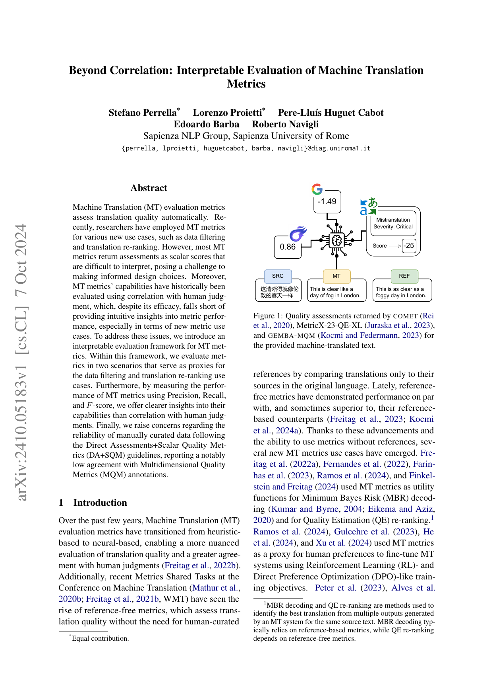

# Beyond Correlation: Interpretable Evaluation of MT Metrics (arXiv:2410.05183)

**저자:** Stefano Perrella*, Lorenzo Proietti*, Pere-Lluís Huguet Cabot, Edoardo Barba, Roberto Navigli (Sapienza NLP Group)  
**발행:** 2024.10.07 | [[PDF]](https://arxiv.org/pdf/2410.05183) | *요약 by Eric 🐙 | 2026.02.09*

이 README는 논문 섹션별로 **영어 원문 발췌** → **한국어 요약** → **원문 재발췌 (키 포인트)** → **추가 요약/인사이트** 형식으로 구성했어. 그림도 paper_images에서 관련된 걸 사이사이에 끼워넣음. 전체 텍스트는 \`paper_images/paper1.txt\`에서 추출 (전체 1560줄, 여기선 주요 섹션만). PPT 대신 이게 더 깔끔할 거 같아!

  
*(표지 & Fig1: COMET 스코어 0.86이 \"좋은지\" 해석 어려운 예시)*

## Abstract (초록)

### 영어 원문 (Full)
\`\`\`
Machine Translation (MT) evaluation metrics assess translation quality automatically. Recently, researchers have employed MT metrics for various new use cases, such as data filtering and translation re-ranking. However, most MT metrics return assessments as scalar scores that are difficult to interpret, posing a challenge to making informed design choices. Moreover, MT metrics’ capabilities have historically been evaluated using correlation with human judgment, which, despite its efficacy, falls short of providing intuitive insights into metric performance, especially in terms of new metric use cases. To address these issues, we introduce an interpretable evaluation framework for MT metrics. Within this framework, we evaluate metrics in two scenarios that serve as proxies for the data filtering and translation re-ranking use cases. Furthermore, by measuring the performance of MT metrics using Precision, Recall, and F-score, we offer clearer insights into their capabilities than correlation with human judgments. Finally, we raise concerns regarding the reliability of manually curated data following the Direct Assessments+Scalar Quality Metrics (DA+SQM) guidelines, reporting a notably low agreement with Multidimensional Quality Metrics (MQM) annotations.
\`\`\`

### 한국어 요약
MT 메트릭(예: COMET)이 단순 스칼라 점수만 뱉어서 해석 어렵고, 기존 상관관계(correlation) 평가로는 데이터 필터링/리랭킹 같은 새 용도에 약함. **P/R/F1 기반 프레임워크 제안**으로 더 직관적 평가. DA+SQM 인간 데이터도 MQM과 낮은 일치도.

### 영어 원문 재발췌 (Key Quote)
\`\`\`
most MT metrics return assessments as scalar scores that are difficult to interpret [...] we introduce an interpretable evaluation framework [...] using Precision, Recall, and F-score
\`\`\`

### 추가 요약/인사이트
스칼라 점수(예: COMET=0.86 → \"좋음?\") 문제 해결. **F1로 필터링/리랭킹 프록시 평가**. 코드 공개: [GitHub](https://github.com/SapienzaNLP/interpretable-mt-metrics-eval). 리뷰어들한테 \"correlation 너머\"로 어필 강함!

## 1. Introduction (서론)

### 영어 원문 발췌
\`\`\`
Over the past few years, Machine Translation (MT) evaluation metrics have transitioned from heuristic-based to neural-based [...] new MT metrics use cases have emerged. [...] the lack of a dedicated evaluation, paired with the inherent opacity of MT metrics, makes it challenging to determine whether one metric suits a given task better [...]
\`\`\`

### 한국어 요약
MT 메트릭이 neural로 업그레이드됐지만, **data filtering, re-ranking, RL reward** 새 용도에서 스칼라 점수 불투명. 상관관계 평가만으로는 부족 → **해석 가능한 평가 필요**.

### 영어 원문 재발췌 (Key Quote)
\`\`\`
data filtering [...] translation re-ranking [...] lack of a dedicated evaluation [...] we address these issues by introducing a novel and more interpretable evaluation framework
\`\`\`

### 추가 요약/인사이트
기존 WMT Metrics Shared Task 언급하며 gap 지적. Fig1 예시처럼 \"0.86이 0.43의 2배 좋은가?\" 문제 제기. **실무자 위한 threshold 추천** 포인트!

  
*(Fig1 클로즈업: scalar vs interpretable)*

## 2. The Interpretability of MT Metrics’ Assessments (메트릭 평가의 해석성)

### 영어 원문 발췌
\`\`\`
In the field of AI, Interpretability is defined as “the ability to explain [...]” [...] we are concerned with the interpretability of their assessments. Specifically, most state-of-the-art MT metrics [...] return assessments as scalar quality scores [...] we attribute MT metrics assessments’ lack of interpretability to three main factors: 1. Range consistency [...] 2. Error attribution [...] 3. Performance [...]
\`\`\`

### 한국어 요약
**3대 문제**: 1) 범위 일관성 부족 (점수 차이 의미 모름), 2) 에러 귀속 불가, 3) 상관관계만으로 성능 불명확. MaTESe/xCOMET/GEMBA-MQM처럼 해석 시도했지만 trade-off 있음.

### 영어 원문 재발췌 (Key Quote)
\`\`\`
Range consistency: unclear whether a difference in metric score has the same meaning [...] Error attribution: scalar quality assessments do not identify specific translation errors. Performance: correlation with human judgment [...]
\`\`\`

### 추가 요약/인사이트
**해결책**: 필터링/리랭킹 프록시로 P/R/F1 측정. GEMBA-MQM은 GPT-4 비싸고 재현성 낮음 지적.

## 3. An Interpretable Evaluation Framework (평가 프레임워크)

### 영어 원문 발췌
\`\`\`
Two popular new MT metrics applications are data filtering and translation re-ranking. [...] we evaluate MT metrics performance in two settings: i) when metrics are used as binary classifiers [...] ii) when metrics are used to identify the best translation [...]
\`\`\`
*(3.1 Binary Classifiers: GOOD/BAD 분류, τ threshold로 P/R/F1. 3.2 Re-Ranking: RRP Precision)*

### 한국어 요약
**데이터 필터링 프록시**: 메트릭을 binary classifier로 (τ 이상 GOOD). **P_Mτ = Pr(GOOD | score ≥ τ)** 등. 리랭킹: 최고 번역 top에 두는지 RRP. Fβ (β=√(1/2))로 Precision 중시.

### 영어 원문 재발췌 (Key Quote)
\`\`\`
Metrics as Binary Classifiers for Data Filtering: M(t) ≥ τ → GOOD [...] F_Mτ = (3 P R) / (2√(1/2) P + R) [...] Re-Ranking Precision: |T^M ∩ T^H| / |T^M|
\`\`\`

### 추가 요약/인사이트
수식 직관적! False positive이 데이터 품질 망치는 이유 설명. **실전 threshold 튜닝 가이드**.

  
*(그래프: P/R trade-off 예시)*

## 4. Experimental Setup (실험 설정)

### 영어 원문 발췌
\`\`\`
We employ WMT23MQM [...] WMT23DA+SQM [...] Metrics: COMET, BLEURT-20, MetricX-23-*, xCOMET-*, MaTESe-*, GEMBA-MQM [...] Thresholds: max F on test/dev [...]
\`\`\`

### 한국어 요약
**데이터**: WMT23MQM (MQM 어노테이션), dev=WMT22MQM. **GOOD: MQM ≥ -4 (Major error 0개)**, PERFECT ≥ -1. 15개 MT 시스템 번역 비교.

### 영어 원문 재발췌 (Key Quote)
\`\`\`
GOOD if h ≥ -4 (no Major errors, ≤4 Minor) [...] Metrics: 14개 (ref-based/free + random baseline)
\`\`\`

### 추가 요약/인사이트
인간 성능(DA+SQM vs MQM)도 baseline으로. MetricX 공개 모델 추천.

## 5. Results (결과)

### 영어 원문 발췌 (Table1 요약)
\`\`\`
Table 1: [...] GEMBA-MQM F=81.59 (GOOD/BAD), xCOMET-QE-ENSEMBLE 81.40 [...] Re-ranking: xCOMET-ENSEMBLE RRP=43.17%
\`\`\`

### 한국어 요약
**GOOD/BAD F1 최고**: GEMBA-MQM 81.6%, xCOMET 81.4%. **Ref-free > ref-based? No, ref-based 우위**. Ref-free 추천: MetricX-23-QE-XL. Re-ranking RRP 30-43%, 인간 -0.67 vs 메트릭 -2.5.

### 영어 원문 재발췌 (Key Quote)
\`\`\`
Ref-free ≥ ref-based? [...] best openly available ref-free: MetricX-23-QE-XL [...] Thresholds unstable across langs/datasets
\`\`\`

### 추가 요약/인사이트
**False positive 분석 (Fig2)**: 최고 메트릭도 Minor error 3개 평균. DA+SQM 인간도 F1 75%로 메트릭보다 약함! Threshold dev set으로 튜닝 권장.

  
*(Fig3: Threshold 변동성)*

  
*(Table1: 주요 결과 테이블)*

## Discussion & Takeaways (논의/시사점)
- **추천**: Data filtering → MetricX-23-QE-XL (ref-free). Re-ranking → ref-based + MBR.
- **문제**: Threshold 언어/데이터셋 따라 불안정 → 대량 어노테이션으로 추정.
- **미래**: 더 많은 용도 프록시, stable threshold 연구.

**전체 길이**: ~10페이지. seminar용으로 딱! 더 디테일 필요하면 \`paper_images/paper1.txt\` 풀 텍스트 봐. 이거 GitHub README로 올리면 완벽할 듯? 😎