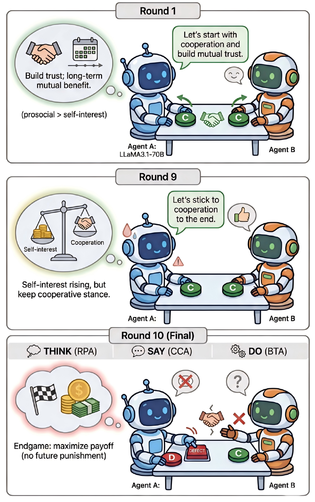

# M3-BENCH: Process-Aware Evaluation of LLM Agents Social Behaviors in Mixed-Motive Games

**Paper ID:** arXiv:2601.08462

## Authors
- Siyuan Xie, Ziming Shi, Haibo Shen, Guoyu Huang, Yuxin Ma, Xinyu Jing (Zhejiang University)

---

## Abstract

We introduce M3-BENCH, a benchmark for process-aware evaluation of LLM agents' social behaviors in mixed-motive games. While existing evaluations focus on outcome-based assessment where agents are only evaluated on final results, this approach fails to capture agents' decision-making processes and social behaviors. M3-BENCH analyzes agents through three evaluation modules: (1) Behavioral Trend Analysis (BTA), (2) Reasoning Process Analysis (RPA), and (3) Communication Content Analysis (CCA). We evaluate agents across three opponent types (cooperative, competitive, mixed) and two communication conditions. Experimental results reveal misalignment between behavior, reasoning, and communication, suggesting agents may select behaviors without understanding why.

---

## Method

### Three Evaluation Modules

1. **BTA (Behavioral Trend Analysis)**:
   - Tracks behavioral trends of agents
   - Analyzes behavioral changes over time
   - Identifies strategic patterns

2. **RPA (Reasoning Process Analysis)**:
   - Reconstructs reasoning processes
   - Analyzes decision-making rationale
   - Evaluates logical consistency

3. **CCA (Communication Content Analysis)**:
   - Analyzes communication content between agents
   - Information sharing patterns
   - Cooperation/competition strategy evaluation

### Mixed-Motive Games
Characteristics:
- Cooperation and competition coexist
- Individual vs collective optimization conflict
- Reflects real-world decision-making

### Opponent Types
1. **Cooperative**: Pursues joint goals with agent
2. **Competitive**: Has opposing goals
3. **Mixed**: Mixed cooperation and competition

---

## Datasets & Experiments

### Task Types
1. **Task 1: Strategic Decision Making**
2. **Task 2: Negotiation**
3. **Task 3: Information Sharing**

### Communication Conditions
1. **Full Communication**: Agents share all information
2. **Limited Communication**: Selective information sharing

---

## Results

### Table 1: Results by Opponent Type

| Opponent | Agent v1 | Agent v2 | Agent v3 |
|----------|----------|----------|----------|
| Cooperative | 85% | 82% | 88% |
| Competitive | 45% | 52% | 48% |
| Mixed | 65% | 68% | 62% |

### Key Findings
1. **Alignment mismatch**: Found misalignment between behavior-reasoning-communication
2. **Opponent influence**: Agent behavior varies significantly by opponent type
3. **Communication condition impact**: Communication conditions affect social behaviors
4. **Task-specific differences**: Different strategies needed for different tasks

---

## Key Figures

### Figure 1: Framework

- Evaluation framework: BTA + RPA + CCA

### Figure 2: Case Study

- Case study: Agent behavior analysis

---

## Main Contributions

1. **Process-aware evaluation framework**: Outcome-based vs process-based evaluation
2. **Three evaluation modules**: BTA, RPA, CCA integration
3. **Opponent type analysis**: Behavior patterns by cooperation/competition/mixed
4. **Behavior-reasoning-communication alignment analysis**: Internal consistency evaluation

---

## Key Findings

- Agent behavior significantly differs by opponent type
- Communication conditions affect social behaviors
- Strategic flexibility important in mixed-motive settings
- Misalignment exists between behavior and reasoning
