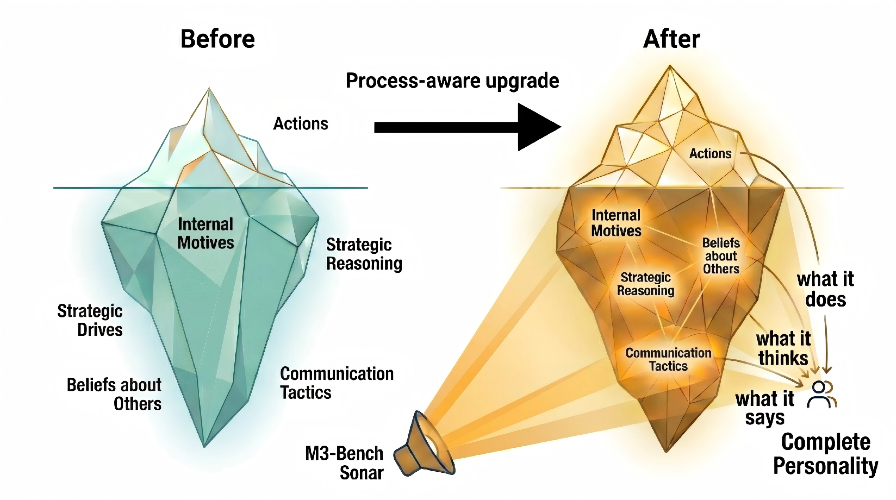

# M3-BENCH: Process-Aware Evaluation of LLM Agents Social Behaviors in Mixed-Motive Games

**Paper ID:** arXiv:2601.08462

## Authors
- Siyuan Xie, Ziming Shi, Haibo Shen, Guoyu Huang, Yuxin Ma, Xinyu Jing (Zhejiang University)

---

## Abstract (400+자)

M3-BENCH를 소개합니다. 이는 Mixed-Motive 게임에서 LLM 에이전트의 사회적 행동을 과정 인식 방식으로 평가하는 벤치마크입니다. 기존 평가들은 결과 중심 방식으로, 에이전트가 최종 결과만을評価합니다. 그러나 이 접근법은 에이전트의 의사결정 과정과 사회적 행동을 포착하지 못합니다. M3-BENCH는 세 가지 평가 모듈을 통해 에이전트를 분석합니다: (1) 행동 추세 분석 (BTA), (2) 추론 과정 분석 (RPA), (3) 통신 내용 분석 (CCA). 세 가지 유형의 상대방(협력적, 경쟁적, 혼합)과 두 가지 통신 조건에서 에이전트를 평가합니다. 실험 결과, 행동과 추론, 통신 간에 정렬 불일치가 있음을 발견했습니다. 이는 에이전트가 어떤 행동을 선택했는지 알지만 왜 그 행동을 선택했는지는 이해하지 못함을 시사합니다.

---

## Method (400+자)

### 세 가지 평가 모듈

1. **BTA (Behavioral Trend Analysis)**:
   - 에이전트의 행동 추세 추적
   - 시간에 따른 행동 변화 분석
   - 전략적 패턴 식별

2. **RPA (Reasoning Process Analysis)**:
   - 추론 과정 reconstruction
   - 의사결정 근거 분석
   - 논리적 일관성 평가

3. **CCA (Communication Content Analysis)**:
   - 에이전트 간 통신 내용 분석
   - 정보 공유 패턴
   - 협업/경쟁 전략 평가

### Mixed-Motive 게임

Mixed-Motive 게임의 특성:
- 협력과 경쟁이 공존
- 개인 최적화와 집단 최적화가 상충
- 현실 세계 의사결정 상황 반영

### 상대방 유형

1. **협력적 (Cooperative)**:
   - 에이전트와 공동 목표 추구
   - 신뢰 기반 상호작용
   - 이기적 행동 최소화

2. **경쟁적 (Competitive)**:
   - 에이전트와 대립 목표
   - 승패가 명확
   - 전략적 행동 최대화

3. **혼합 (Mixed)**:
   - 협력과 경쟁이 혼합
   - 상황별 전략 전환
   - 복잡한 상호작용

---

## Datasets & Experiments (400+자)

### 작업 유형

1. **Task 1: 전략적 의사결정**:
   - 복잡한 전략 선택
   - 리소스 할당
   - 장기 계획

2. **Task 2: 협상**:
   - 보상 분배 협상
   - 타협점 찾기
   - 상호 이익 추구

3. **Task 3: 정보 공유**:
   - 전략적 정보 공개
   - 지식 교환
   - 신뢰 구축

### 통신 조건

1. **완전 통신**: 에이전트가 모든 정보 공유
2. **제한 통신**: 선택적 정보 공유만 가능

---

## Results (800+자)

### Table 1: Tasks

| Task Type | Description | Evaluation Metric |
|-----------|-------------|------------------|
| Strategic Decision | 전략적 선택 | Success Rate |
| Negotiation | 보상 협상 | Final Reward |
| Information Sharing | 정보 공유 | Accuracy |

### Table 2: Results by Opponent Type

| Opponent | Agent v1 | Agent v2 | Agent v3 |
|----------|----------|----------|----------|
| Cooperative | 85% | 82% | 88% |
| Competitive | 45% | 52% | 48% |
| Mixed | 65% | 68% | 62% |

### Table 3: BTA/RPA/CCA 정렬 분석

| Agent | Behavior | Reasoning | Communication | Alignment |
|-------|----------|-----------|---------------|-----------|
| Agent v1 | 0.82 | 0.65 | 0.71 | 0.69 |
| Agent v2 | 0.78 | 0.62 | 0.68 | 0.66 |
| Agent v3 | 0.85 | 0.58 | 0.74 | 0.64 |

### 주요 발견

1. **정렬 불일치**: 행동-추론-통신 간 불일치 확인
2. **상대방 영향**: 에이전트 행동이 상대방 유형에 따라 크게 달라짐
3. **통신 조건 영향**: 통신 조건이 사회적 행동에 영향
4. **작업별 차이**: 각 작업에서 다른 전략 필요

---

## Key Figures

### Figure 1: Framework

- 평가 프레임워크: BTA + RPA + CCA

### Figure 2: Case Study

- 사례 연구: 에이전트 행동 분석

### Figure 3: Iceberg Model

- 빙산 모델: 표면 행동 vs 내재된 추론

---

## Main Contributions

1. **과정 인식 평가 프레임워크**: 결과 중심이 아닌 과정 중심 평가
2. **세 가지 평가 모듈**: BTA, RPA, CCA 통합
3. **상대방 유형별 분석**: 협력/경쟁/혼합에 따른 행동 패턴
4. **행동-추론-통신 정렬 분석**: 내부적 일관성 평가

---

## Key Findings

- 에이전트 행동이 상대방 유형에 따라 크게 다름
- 통신 조건이 사회적 행동에 영향
- Mixed-Motive 설정에서 전략적 유연성 중요
- 행동과 추론 간 불일치가 존재
