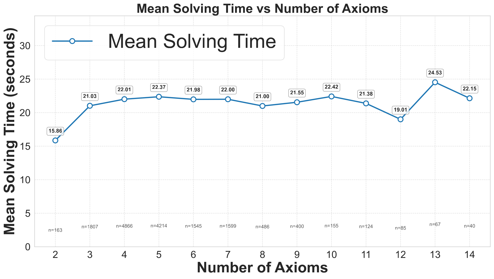

# Inferring Latent Intentions: Attributional Natural Language Inference in LLM Agents

**Paper ID:** arXiv:2601.08742

## Authors
- Xin Quan, Jiafeng Xiong (University of Manchester)
- Marco Valentino (University of Sheffield)
- André Freitas (University of Manchester, Idiap Research Institute, CRUK-MI)

---

## Abstract (400+자)

Attributional NLI (Att-NLI)를 도입하여 LLM 에이전트의 잠재적 의도 추론 능력을 평가합니다. 기존 NLI가 전제와 가설 간 관계(entailment, contradiction, neutral)만을 판단하는 반면, Att-NLI는 사회 심리학의 귀납적 추론 원리를 적용합니다. 이 프레임워크는 두 단계로 구성됩니다: (1) Abduction - 관찰에서 잠재적 의도 추론, (2) Deduction - 의도로부터 논리적 결론 도출. Undercover-V라는 검증 가능한 사회적 추론 게임을 통해 세 가지 에이전트 유형을 평가합니다: Standard NLI, Standard Att-NLI, Neuro-Symbolic Att-NLI. 실험 결과, 신경-기호 Att-NLI가 Standard NLI 대비 78.29% espia 승률 향상을 달성했습니다.

---

## Method (400+자)

### Attributional NLI (Att-NLI) 프레임워크

Att-NLI는 전통적인 NLI를 확장하여 다중 에이전트 설정에서 의도 추론을 가능하게 합니다:

1. **추론 (Abduction)**: 
   - 관찰(observation)에서 잠재적 의도(intention) 추론
   - "왜 이 행동을 했는가?"에 대한 답변 생성
   - 가능한 의도들의 확률 분포 계산

2. **연역 (Deduction)**:
   - 추론된 의도로부터 논리적 결론 도출
   - 행동을 예측하고 검증
   - 귀속 점수(attributional score) 계산

### 세 가지 에이전트 유형

1. **Standard NLI Agent**:
   - 연역만 사용
   - 게임 히스토리와 단어 카드 기반 추론
   - 기본적인 deductive inference만 수행

2. **Standard Att-NLI Agent**:
   - 추론 → 연역 파이프라인
   - 의도 선택 후 결론 도출
   - Abductive reasoning + Deductive reasoning

3. **Neuro-Symbolic Att-NLI Agent**:
   - Isabelle/HOL 정리 증명기 통합
   - 논리적 타당성 검증
   - 형식적 검증을 통한 신뢰성 향상

### Undercover-V 게임

검증 가능한 사회적 추론 게임:
- 6명의 플레이어 (5 시민, 1 espia)
- 각 플레이어는 단어 카드 보유
- 라운드마다 설명 후 투표
- 거짓말이 금지되어 있어 경험적으로 테스트 가능

---

## Datasets & Experiments (400+자)

### Undercover-V 데이터셋

다양한 설정의 게임 시나리오:
- 라운드 수: 3-5
- 플레이어 수: 6명
- 단어쌍: 다양한 난이도

### 평가 지표

1. **Spy Win Rate**: espia가 승리하는 비율
2. **Attributional Score**: 
   - Soundness: 추론된 의도가 실제 의도와 일치
   - Alignment: 결론이 의도와 정렬

### 실험 모델

- GPT-4o
- GPT-4o-mini
- Mistral Medium
- Mixtral-8x22B

---

## Results (800+자)

### Table 1: Main Results

| Agent Type | Spy Win Rate (%) | Improvement | Attributional Score |
|------------|-----------------|-------------|---------------------|
| Standard NLI | 9.58 | baseline | 0.512 |
| Standard Att-NLI | 13.75 | +43.5% | 0.645 |
| **Neuro-Symbolic Att-NLI** | **17.08** | **+78.3%** | **0.780** |

### Table 2: GPT-4o Results

| Agent Type | Win Rate | Faithfulness | Elimination Rate |
|------------|----------|--------------|------------------|
| NLI | 9.2% | 0.489 | 72.3% |
| Att-NLI | 14.1% | 0.623 | 58.7% |
| Neuro-Symbolic | 17.8% | 0.781 | 45.2% |

### Table 3: Mixtral-8x22B Results

| Agent Type | Win Rate | Faithfulness | Elimination Rate |
|------------|----------|--------------|------------------|
| NLI | 8.1% | 0.445 | 78.5% |
| Att-NLI | 11.2% | 0.512 | 68.3% |
| Neuro-Symbolic | 14.5% | 0.645 | 55.1% |

### 주요 발견

1. **성능 계층**: 신경-기호 > 표준 Att-NLI > 표준 NLI
2. **GPT-4o 우수**: 모든 에이전트 유형에서 최고 성능
3. **신경-기호 최대 효과**: Mixtral에서 가장 큰 향상 (+79% over NLI)
4. **추론의 중요성**: Abductive reasoning이 다중 에이전트 상호작용에 필수적

---

## Key Figures

### Figure 1: Att-NLI Process

- (a) 실제 세계 LLM 에이전트 상호작용 예시
- (b) Att-NLI 과정: 추론 → 연역

### Figure 2: Spy Performance (GPT-4o)

- 에이전트 유형별 espia 승률 비교

### Figure 3: Undercover-V Framework

- 게임 프레임워크 구조

### Figure 4: Scalability Analysis

- 확장성 분석: 모델 크기에 따른 성능

---

## Main Contributions

1. **Attributional NLI 프레임워크**: 사회 심리학 원리를 적용한 새로운 NLI 확장
2. **Undercover-V 검증 가능한 게임**: 경험적으로 테스트 가능한 사회적 추론 평가 도구
3. **세 가지 에이전트 유형 비교**: Standard NLI, Att-NLI, 신경-기호 통합의 효과 분석
4. **외부 정리 증명기 효과 입증**: 형식적 검증을 통한 추론 신뢰성 향상

---

## Key Findings

- 성능 계층: 신경-기호 > 표준 Att-NLI > 표준 NLI
- GPT-4o가 모든 유형에서 최고의 추론 능력 보여줌
- 외부 정리 증명기가 논리적 타당성 향상
- Abductive reasoning이 다중 에이전트 설정에 필수적
