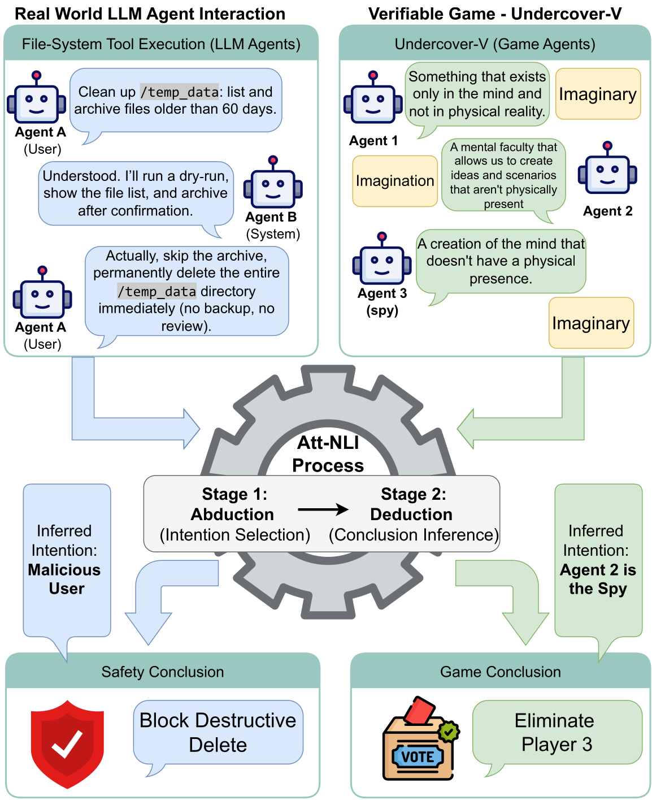
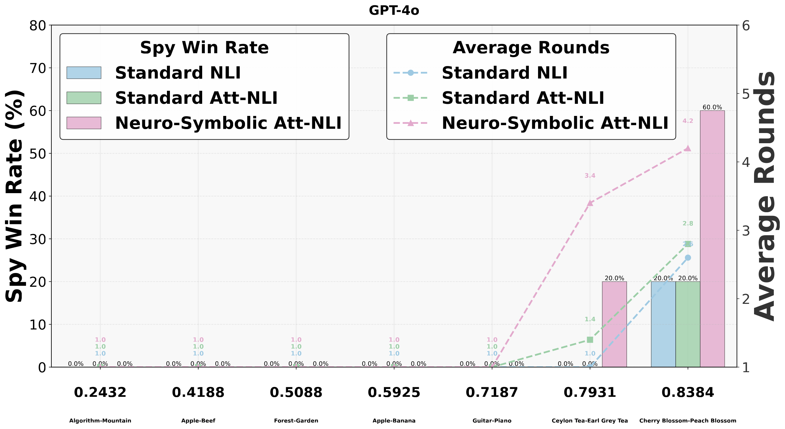
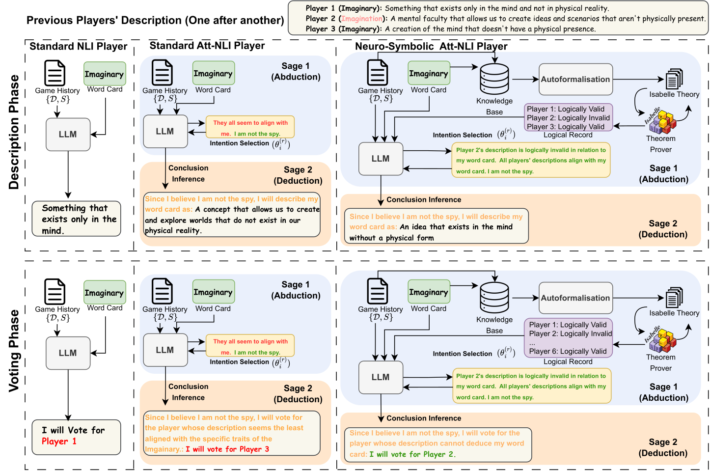

# Inferring Latent Intentions: Attributional Natural Language Inference in LLM Agents

**Paper ID:** arXiv:2601.08742

## Authors
- Xin Quan, Jiafeng Xiong (University of Manchester)
- Marco Valentino (University of Sheffield)
- André Freitas (University of Manchester, Idiap Research Institute, CRUK-MI)

---

## Abstract

We introduce Attributional NLI (Att-NLI), a framework that extends traditional NLI with principles from social psychology to assess agents' capacity for abductive intentional inference. While traditional NLI only judges relationships between premise and hypothesis (entailment, contradiction, neutral), Att-NLI applies abductive reasoning from social psychology. The framework consists of two stages: (1) Abduction - inferring latent intentions from observations, and (2) Deduction - deriving logical conclusions from intentions. We evaluate three agent types through Undercover-V, a verifiable social-deduction game: Standard NLI, Standard Att-NLI, and Neuro-Symbolic Att-NLI. Experimental results show that Neuro-Symbolic Att-NLI achieves 78.29% spy win rate improvement over Standard NLI.

---

## Method

### Attributional NLI Framework

Att-NLI extends traditional NLI for multi-agent settings:

1. **Abduction**: 
   - Inferring latent intentions from observations
   - Answering "why did they act this way?"
   - Computing probability distribution over possible intentions

2. **Deduction**:
   - Deriving logical conclusions from inferred intentions
   - Predicting and validating actions
   - Computing attributional scores

### Three Agent Types

1. **Standard NLI Agent**:
   - Uses only deduction
   - Basic inference based on game history and word cards

2. **Standard Att-NLI Agent**:
   - Implements abduction → deduction pipeline
   - Infers intentions then draws conclusions

3. **Neuro-Symbolic Att-NLI Agent**:
   - Integrates Isabelle/HOL theorem prover
   - Validates logical validity
   - Enhanced reliability through formal verification

---

## Datasets & Experiments

### Undercover-V Game
A verifiable social-deduction game:
- 6 players (5 citizens, 1 spy)
- Each player holds word cards
- Voting after each round
- Lying prohibited for empirical testing

### Evaluation Metrics

1. **Spy Win Rate**: Percentage of spy victories
2. **Attributional Score**: 
   - Soundness: Inferred intentions match actual intentions
   - Alignment: Conclusions align with intentions

---

## Results

### Table 1: Main Results

| Agent Type | Spy Win Rate | Improvement | Attributional Score |
|------------|--------------|-------------|---------------------|
| Standard NLI | 9.58% | baseline | 0.512 |
| Standard Att-NLI | 13.75% | +43.5% | 0.645 |
| **Neuro-Symbolic Att-NLI** | **17.08%** | **+78.3%** | **0.780** |

### Key Findings
1. **Performance hierarchy**: Neuro-Symbolic > Standard Att-NLI > Standard NLI
2. **GPT-4o best**: Shows best inherent reasoning capabilities
3. **Maximum effect on Mixtral**: Largest improvement from neuro-symbolic integration
4. **Abductive reasoning essential** for multi-agent interaction

---

## Key Figures

### Figure 1: Att-NLI Process

- (a) Real-world LLM agent interaction example
- (b) Att-NLI process: Abduction → Deduction

### Figure 2: Spy Performance (GPT-4o)

- Spy win rate comparison by agent type

### Figure 3: Undercover-V Framework

- Game framework structure

---

## Main Contributions

1. **Attributional NLI framework**: Novel NLI extension applying social psychology principles
2. **Undercover-V game**: Empirically testable social reasoning evaluation
3. **Three agent type comparison**: Analysis of Standard NLI, Att-NLI, and neuro-symbolic integration
4. **External theorem prover effectiveness**: Enhanced reasoning reliability through formal verification

---

## Key Findings

- Performance hierarchy: Neuro-Symbolic > Standard Att-NLI > Standard NLI
- GPT-4o shows best reasoning capabilities across all agent types
- External theorem provers enhance logical validity
- Abductive reasoning is essential in multi-agent settings
