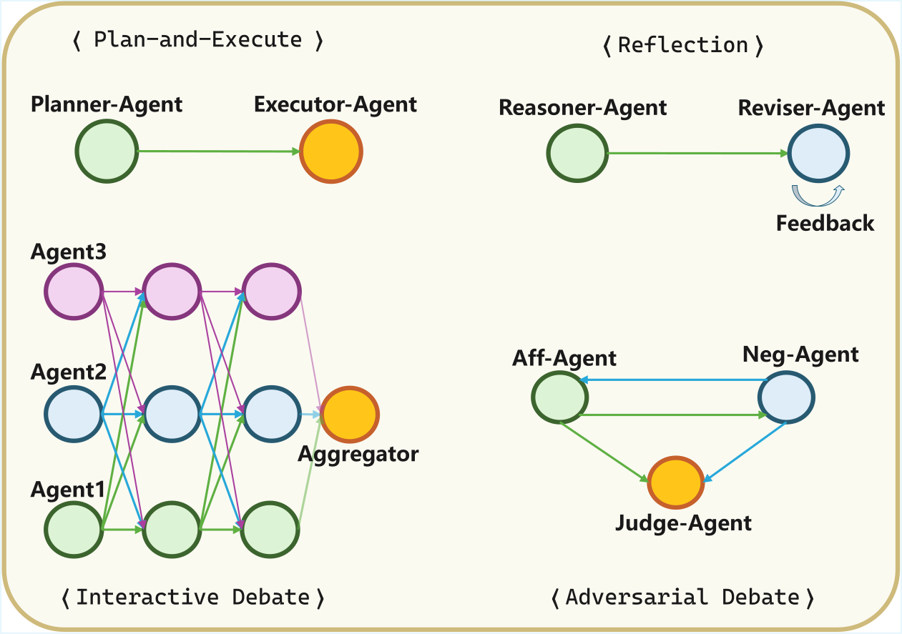
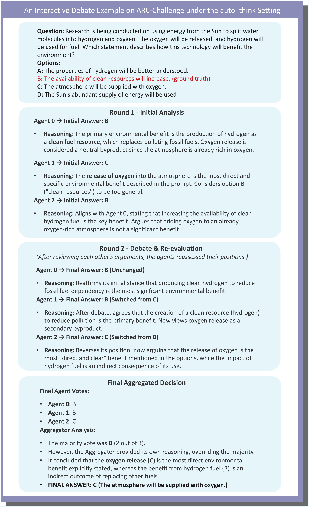

# A Comprehensive Evaluation of LLM Reasoning: From Single-Model to Multi-Agent Paradigms

**Paper ID:** arXiv:2601.13243

## Authors
- Yapeng Li, Jiakuo Yu, Zhixin Liu, Xinnan Liu, Jing Yu, Songze Li, Tonghua Su (Harbin Institute of Technology)

## Abstract
직접 생성, CoT 증강, 다중 에이전트 시스템(MAS)을 포괄하는 추론 패러다임의 포괄적인 평가합니다. MIMeBench 벤치마크를 도입합니다.

## Method

### 추론 패러다임
1. **Direct Generation**: 직접 출력
2. **Chain-of-Thought**:思考 체인
3. **Plan-and-Execute**: 계획 → 실행
4. **Reflection**: 반성
5. **Debate**: 토론

### MAS Workflows
- Plan-and-Execute: Planner → Executor → Reviser
- Reflection: 실행 + 반성 단계
- Interactive Debate: 다중 에이전트 +Aggregator
- Adversarial Debate: Affirmative vs Negative + Judge

## Results

### Table 1: Benchmark 선택

| 카테고리 | 벤치마크 | 지표 |
|----------|----------|------|
| 수학 | AQUA, GSM8K, GSM-Hard, AIME-2024 | Accuracy |
| 일반 이해 | ARC-Easy, ARC-Challenge, CommonsenseQA, GPQA-Diamond | Accuracy |
| 코드 생성 | HumanEval, HumanEval+ | Pass@1 |
| 개방형 | MIMeBench | Avg Score |

### Table 2: Model Comparison

| Model | AIME-2024 | HumanEval+ |
|-------|-----------|------------|
| Pangu-7B | 86.67% | 90.24% |
| Qwen3-8B | 84.12% | 87.50% |
| DeepSeek-R1-Distill | 87.50% | 89.20% |

## Key Figures

### Figure 1: Study Overview

- 평가 프레임워크 개요

### Figure 2: MAS Workflows

- MAS 워크플로 유형

### Figure 3: Case Study

- 사례 연구

## Main Contributions
1. 포괄적인 패러다임 평가
2. MIMeBench 벤치마크
3. 비용-정확도 tradeoff 분석

## Key Findings
- 구조적 복잡성이 항상 추론 향상시키지 않음
- 작업 유형에 따라 최적 패러다임이 다름
