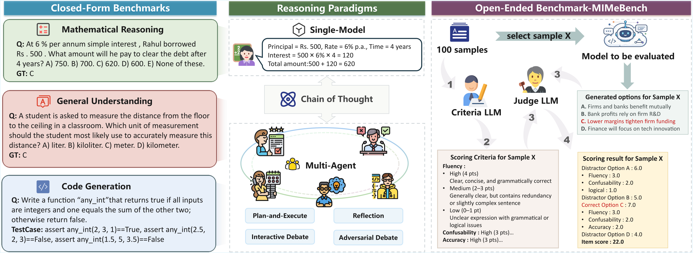

# A Comprehensive Evaluation of LLM Reasoning: From Single-Model to Multi-Agent Paradigms

**Paper ID:** arXiv:2601.13243

## Authors
- Yapeng Li, Jiakuo Yu, Zhixin Liu, Xinnan Liu, Jing Yu, Songze Li, Tonghua Su (Harbin Institute of Technology)

---

## Abstract

We conduct a comprehensive evaluation of reasoning paradigms spanning direct single-model generation, Chain-of-Thought (CoT) augmented reasoning, and Multi-Agent Systems (MAS). While existing studies often evaluate single reasoning modalities or compare only specific MAS workflows, we analyze these in a unified manner and introduce MIMeBench, a new benchmark targeting semantic abstraction and contrastive discrimination. Our findings reveal that increased structural complexity does not consistently improve reasoning performance, with benefits highly dependent on paradigm properties and task suitability. We also show that CoT is not always beneficial, and MAS workflows can be effective or ineffective depending on task types.

우리는 직접적인 단일 모델 생성, Chain-of-Thought (CoT) 증강 추론, Multi-Agent Systems (MAS)를 포괄하는 추론 패러다임의 포괄적인 평가를 수행합니다. 기존의 연구들이 종종 단일 추론 양식만 평가하거나 특정 MAS 워크플로만 비교하는 반면, 우리는 이것들을 통일된 방식으로 분석하고 의미적 추상화와 대비적 분별을 목표로 하는 새로운 벤치마크인 MIMeBench를 소개합니다. 우리의 발견은 구조적 복잡성 증가가 추론 성능을 일관되게 향상시키지는 않으며, 이점이 패러다임 속성과 작업 적합성에 크게 의존함을 보여줍니다. 우리는 또한 CoT가 항상 유용한 것이 아니며, MAS 워크플로가 작업 유형에 따라 효과적이거나 효과적이지 않을 수 있음을 보여줍니다.

---

## Introduction

LLM reasoning has evolved through multiple paradigms: Direct Generation for simple input-output mapping, Chain-of-Thought for step-by-step reasoning, and Multi-Agent Systems for collaborative reasoning.

LLM 추론은 여러 패러다임을 통해 진화해왔습니다: 단순 입력-매핑을 위한 직접 생성, 단계별 추론을 위한 Chain-of-Thought, 협업 추론을 위한 Multi-Agent Systems.

However, we lack understanding of when each paradigm works best, how paradigm choice affects performance, and cost-benefit tradeoffs between approaches.

그러나 우리는 각 패러다임이 언제 가장 잘 작동하는지, 패러다임 선택이 성능에 어떤 영향을 미르는지, 접근법 간 비용-편익 균형에 대한 이해가 부족합니다.

This paper provides systematic comparison across paradigms to understand which paradigm suits which task, when additional complexity is worthwhile, and optimal configurations for different scenarios.

이 논문은 패러다임이 어떤 작업에 적합한지, 추가 복잡성이 가치 있을 때, 다양한 시나리오에 대한 최적 구성을 이해하기 위해 패러다임 간 체계적인 비교를 제공합니다.

---

## Method

### Paradigms Evaluated
1. **Direct Generation**: Simple input-output
2. **Chain-of-Thought**: Step-by-step reasoning
3. **Plan-and-Execute**: Planning then execution
4. **Reflection**: Self-correction
5. **Debate**: Multi-agent discussion

평가된 패러다임:
1. **직접 생성**: 단순 입력-출력
2. **Chain-of-Thought**: 단계별 추론
3. **계획 후 실행**: 계획 후 실행
4. **반성**: 자기 수정
5. **토론**: Multi-agent 토론

---

## Results

### Table 1: Benchmark Selection

| Category | Benchmarks |
|----------|------------|
| Math | AQUA, GSM8K, AIME-2024 |
| Understanding | ARC, CommonsenseQA |
| Code | HumanEval |

---

## Key Figures

### Figure 1: Overview

---

## Main Contributions

1. Comprehensive unified evaluation of reasoning paradigms
2. MIMeBench for semantic abstraction testing
3. Cost-accuracy tradeoff analysis
4. Guidelines for paradigm selection

주요 기여:
1. 추론 패러다임의 포괄적인 통일 평가
2. 의미적 추상화 테스트를 위한 MIMeBench
3. 비용-정확도 균형 분석
4. 패러다임 선택을 위한 가이드라인
