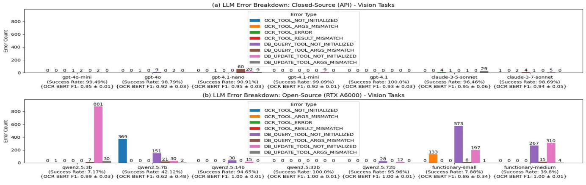

# When Agents Fail to Act: A Diagnostic Framework for Tool Invocation Reliability in Multi-Agent LLM Systems

**Paper ID:** arXiv:2601.16280

## Authors
- Donghao Huang (Singapore Management University / Mastercard)
- Gauri Malwe (Mastercard)
- Zhaoxia Wang (Singapore Management University)

---

## Abstract

We propose a comprehensive diagnostic framework for evaluating tool invocation reliability in multi-agent LLM systems. While recent LLM-based agents have demonstrated remarkable capabilities in accomplishing complex tasks using tools, systematic evaluation of procedural reliability in such multi-agent systems remains lacking. We introduce a 12-category error taxonomy capturing failure modes across tool initialization, parameter handling, execution, and result interpretation. Through systematic evaluation of 1,980 deterministic test instances across 15 LLM configurations, we identify actionable reliability thresholds for production deployment. Our findings reveal that tool initialization failures are the most dominant error type, and open-weight models at 32B parameter scale can achieve closed-source reliability levels.

우리는 multi-agent LLM 시스템에서 도구 호출 신뢰성을 평가하기 위한 포괄적인 진단 프레임워크를 제안합니다. 최근 LLM 기반 에이전트들이 도구를 사용하여 복잡한 작업을 완료하는 remarkable한 역량을 보여왔지만, 이러한 multi-agent 시스템에서 절차적 신뢰성에 대한 체계적인 평가는 여전히 부족합니다. 우리는 도구 초기화, 매개변수 처리, 실행 및 결과 해석에 걸친 실패 모드를 포착하는 12개 카테고리 오류 분류법을 소개합니다. 15개 LLM 구성에 걸친 1,980개의 결정론적 테스트 인스턴스의 체계적인 평가를 통해 프로덕션 배포를 위한 실행 가능한 신뢰성 임계값을 식별합니다. 우리의 발견은 도구 초기화 실패가 가장 지배적인 오류 유형이며, 32B 파라미터 규모의open-weight 모델이 폐쇄소스 신뢰성 수준을 달성할 수 있음을 보여줍니다.

---

## Introduction

Recent advances in LLM-based multi-agent systems have demonstrated significant potential for solving complex tasks through tool invocation. However, while these systems show impressive capabilities in single-step tool usage, their reliability in multi-step workflows remains unclear.

최근 LLM 기반 multi-agent 시스템의 진전은 도구 호출을 통해 복잡한 작업을 해결할 수 있는 잠재력을 보여왔습니다. 그러나 이러한 시스템들은 한 단계 도구 사용에서 인상적인 역량을 보여지만, multi-step 워크플로우에서의 신뢰성은仍未 명확합니다.

The challenge lies in understanding how these systems behave when coordinating multiple agents, each potentially calling different tools at different stages of task execution. Unlike single-agent scenarios, multi-agent systems introduce additional complexity in terms of coordination, shared state management, and error propagation.

도전은 이러한 시스템들이 여러 에이전트를 조정할 때 어떻게 행동하는지 이해하는 데 있습니다. 각 에이전트가 작업 실행의 다른 단계에서 다른 도구를 호출할 수 있으며, single-agent 시나리오와 달리 multi-agent 시스템은 조정, 공유 상태 관리 및 오류 전파 측면에서 추가적인 복잡성을 도입합니다.

This paper addresses this gap by proposing a systematic diagnostic framework for evaluating procedural reliability. We focus on understanding not just whether tasks succeed, but HOW they fail - identifying specific failure modes that can be addressed in future system design.

이 논문은 절차적 신뢰성을 평가하기 위한 체계적인 진단 프레임워크를 제안함으로써 이 격차를 메웁니다. 우리는 작업이 성공하는지 여부가 아니라 어떻게 실패하는지 이해하는 데 중점을 둡니다 - 미래 시스템 설계에서 해결할 수 있는 특정 실패 모드를 식별합니다.

Our contributions include: (1) a comprehensive error taxonomy with 12 categories, (2) systematic evaluation across 15 LLM configurations, (3) identification of reliability thresholds for production deployment, and (4) practical recommendations for system design.

우리의 기여는 (1) 12개 카테고리의 포괄적인 오류 분류법, (2) 15개 LLM 구성에 걸친 체계적 평가, (3) 프로덕션 배포를 위한 신뢰성 임계값 식별, (4) 시스템 설계에 대한 실용적 권장사항을 포함합니다.

---

## Method

### 12-Category Error Taxonomy

1. **Tool Initialization Failures**:
   - DB_UPDATE_TOOL_NOT_INITIALIZED
   - DB_SELECT_TOOL_NOT_INITIALIZED
   - DB_SEARCH_TOOL_NOT_INITIALIZED

도구 초기화 실패:
   - DB 업데이트 도구 초기화 안됨
   - DB 선택 도구 초기화 안됨
   - DB 검색 도구 초기화 안됨

2. **Parameter Errors**:
   - DB_SELECT_QUERY_PARAMETER_ERROR
   - DB_UPDATE_QUERY_PARAMETER_ERROR
   - DB_SEARCH_QUERY_PARAMETER_ERROR

매개변수 오류:
   - DB 선택 쿼리 매개변수 오류
   - DB 업데이트 쿼리 매개변수 오류
   - DB 검색 쿼리 매개변수 오류

3. **Execution Failures**:
   - DB_EXECUTION_FAILURE
   - FILE_READ_TOOL_NOT_INITIALIZED
   - FILE_WRITE_TOOL_NOT_INITIALIZED

실행 실패:
   - DB 실행 실패
   - 파일 읽기 도구 초기화 안됨
   - 파일 쓰기 도구 초기화 안됨

4. **Result Interpretation Errors**:
   - DB_RESULT_INTERPRETATION_ERROR
   - FILE_READ_PARAMETER_ERROR
   - FILE_WRITE_PARAMETER_ERROR

결과 해석 오류:
   - DB 결과 해석 오류
   - 파일 읽기 매개변수 오류
   - 파일 쓰기 매개변수 오류

---

## Datasets & Experiments

### Invoice Reconciliation Task
Involves: database queries, file processing, business logic comparison, result generation.

송장 조정 작업:
database 쿼리, 파일 처리, 비즈니스 로직 비교, 결과 생성을 포함합니다.

### Test Configurations
- **LLM Configurations**: 15 configurations including Qwen2.5 series (3B-72B), GPT-4, Claude 3.5
- **Hardware Platforms**: NVIDIA RTX A6000, RTX 4090, Apple M3 Max

테스트 구성:
- **LLM 구성**: Qwen2.5 시리즈 (3B-72B), GPT-4, Claude 3.5를 포함한 15개 구성
- **하드웨어 플랫폼**: NVIDIA RTX A6000, RTX 4090, Apple M3 Max

---

## Results

### Table 1: Overall Performance

| Model | Success Rate (%) | Time (s) | Steps |
|-------|------------------|----------|-------|
| qwen2.5:3b | 23.64 | 14.7 | 5.4 |
| qwen2.5:7b | 85.45 | 12.3 | 4.2 |
| qwen2.5:14b | 96.64 | 7.3 | 3.1 |
| qwen2.5:32b | 100.0 | 6.8 | 2.9 |
| GPT-4.1 | 100.0 | 7.2 | 3.0 |

---

## Key Figures

### Figure 1: Error Taxonomy Overview

---

## Main Contributions

1. Systematic diagnostic framework with 12-category error taxonomy
2. Reproducible evaluation across 15 LLM configurations
3. Reliability threshold identification
4. Deployment guidance with hardware-performance characterization

주요 기여:
1. 12개 카테고리 오류 분류법을 통한 체계적 진단 프레임워크
2. 15개 LLM 구성을 통한 재현 가능한 평가
3. 신뢰성 임계값 식별
4. 하드웨어-성능 특성을 통한 배포 안내
