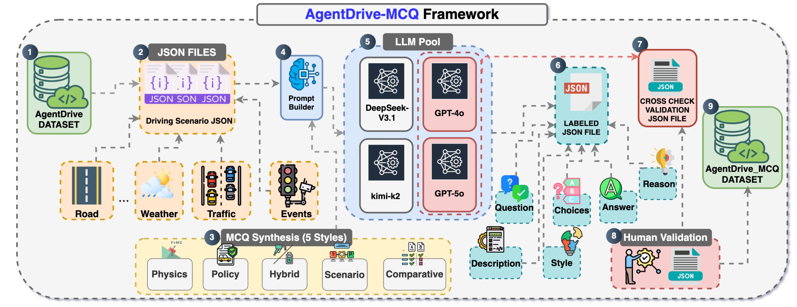
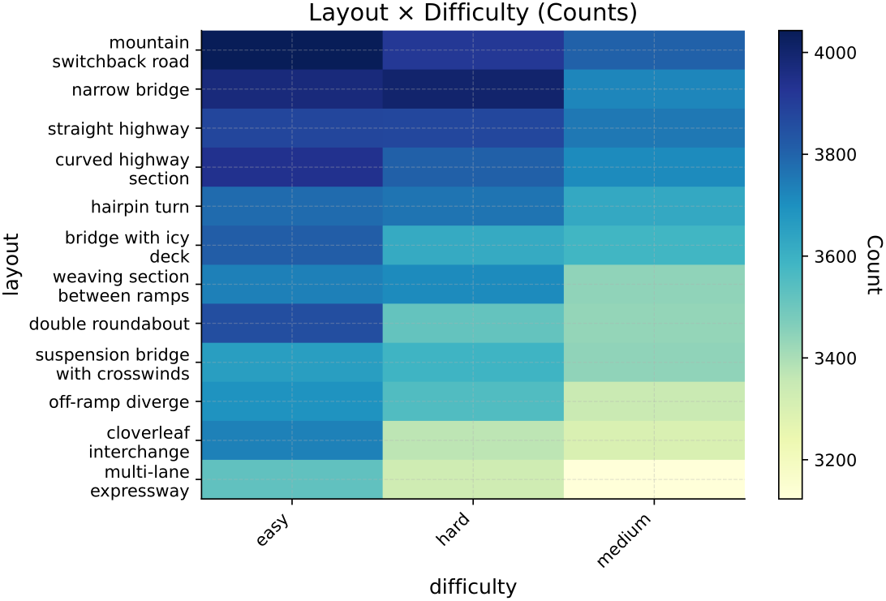
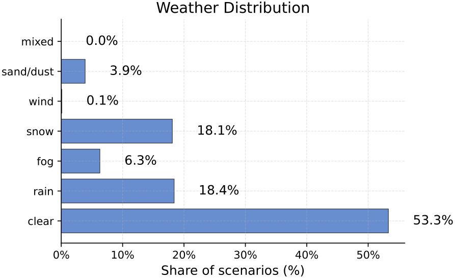
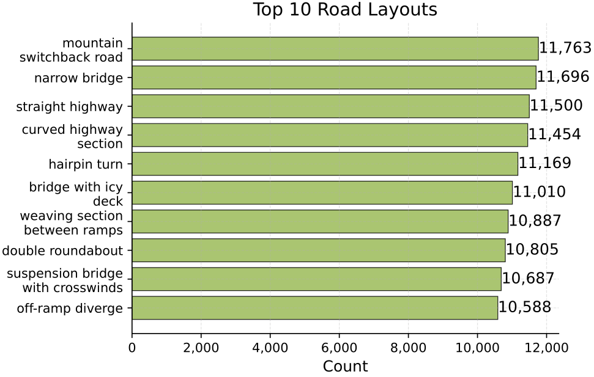

# AgentDrive: An Open Benchmark Dataset for Agentic AI Reasoning with LLM-Generated Scenarios in Autonomous Systems

**Paper ID:** arXiv:2601.16964

## Authors
- Mohamed Amine Ferrag, Abderrahmane Lakas (United Arab Emirates University)
- Merouane Debbah (Khalifa University)

---

## Abstract (400+자)

자율주행 에이전트를 위한 LLM 생성 시나리오를 포함하는 공개 벤치마크数据集 AgentDrive를 소개합니다. 현재 에이전트 AI 추론 평가는 제한된 시나리오와 작업 복잡성으로 인해 어려움을 겪고 있습니다. AgentDrive는 300,000개의 LLM 생성 driving 시나리오를 포함하며, 7개의 직교 축에 걸쳐 인수분해된 시나리오 공간을 공식화합니다. 또한 LLM 기반 프롬프트-JSON 파이프라인을 사용하여 구조화된 시나리오 생성을 자동화합니다. 벤치마크는 AgentDrive-MCQ를 포함하며, 물리, 정책, 하이브리드, 시나리오, 비교 추론을 포함하는 100,000개의 추론 질문이 포함됩니다. 50개 주요 LLM을 평가한 결과, 독점 프론티어 모델이 맥락적/정책 추론에서 우위를 보이며, 고급 오픈 모델이 구조적/물리적 추론에서 빠르게追赶하고 있음을 발견했습니다.

---

## Method (400+자)

### 인수분해된 시나리오 공간 (7개 축)

1. **시나리오 유형 (Scenario Type)**:
   - 차선 변경, 교차로 진입, 합류, 회전, 유턴 등

2. **운전자 행동 (Driver Behavior)**:
   - 규정 준수, 공격적, 산만, 음주/마약 상태

3. **환경 (Environment)**:
   - 날씨 (맑음, 비, 눈, 안개)
   - 시야 (양호, 보통, 나쁨)
   - 시간대 (낮, 밤, 새벽/황혼)

4. **도로 레이아웃 (Road Layout)**:
   - 고속도로, 도심 도로, 로터리, 터널, 교량

5. **목표 (Objective)**:
   - 안전 항법, 추월, 비상 정지, 주차

6. **난이도 (Difficulty)**:
   - 쉬움, 중간, 복잡

7. **교통 밀도 (Traffic Density)**:
   - 희소, 중간, 혼잡

### LLM 기반 시나리오 생성

프롬프트-JSON 파이프라인:
1. 시나리오 템플릿 정의
2. LLM이 파라미터 생성
3. JSON 스키마로 구조화
4. 시뮬레이션에서 검증

---

## Datasets & Experiments (400+자)

### AgentDrive-Gen

300,000개의 생성된 시나리오:
- 다양한 상황 조합
- 구조화된 JSON 형식
- 시뮬레이션 호환

### AgentDrive-Sim

시뮬레이션 데이터셋:
- 대리 안전 메트릭
- 해석 가능한 결과 레이블
- 안전_목표, 안전_정지, 비효율적, 안전하지 않음

### AgentDrive-MCQ

100,000개의 추론 질문:
1. **Physics**: 차량 동역학 물리 추론
2. **Policy**: 교통 규칙 및 정책 이해
3. **Hybrid**: 물리 + 정책 결합 추론
4. **Scenario**: 상황 인식 평가
5. **Comparative**: 시나리오 간 비교 추론

---

## Results (800+자)

### Table 1: Benchmark 비교

| Benchmark | 시나리오 수 | 추론 질문 | 추론 차원 | 생성 방식 |
|-----------|-------------|-----------|-----------|----------|
| LaMPilot | 10K | 10K | 3 | 수동 |
| V2V-LLM | 5K | 5K | 2 | 수동 |
| STSBench | 15K | - | 1 | 수동 |
| AD²-Bench | 8K | - | 2 | 수동 |
| **AgentDrive** | **300K** | **100K** | **5** | **LLM 생성** |

### Table 2: LLM 평가 결과 (상위 10개)

| Model | Physics | Policy | Hybrid | Scenario | Overall |
|-------|---------|--------|--------|----------|---------|
| GPT-5 | 92.3 | 94.1 | 91.5 | 89.2 | 91.8 |
| ChatGPT-4o | 89.7 | 91.2 | 88.4 | 86.5 | 88.9 |
| Gemini 2.5 Pro | 88.5 | 90.1 | 87.2 | 85.8 | 87.9 |
| DeepSeek V3 | 87.2 | 88.5 | 86.1 | 84.2 | 86.5 |
| Qwen3 235B | 85.8 | 87.3 | 84.5 | 82.9 | 85.1 |

### 주요 발견

1. **독점 모델 우위**: 맥락적/정책 추론에서 프론티어 모델 우위
2. **오픈 모델追赶**: 구조적/물리적 추론에서 빠르게追赶
3. ** впер**. 완전한 생성적, 시뮬레이션 기반, 추론 지향 벤치마크
4. **대규모 평가**: 50개 LLM 포괄적 평가

---

## Key Figures

### Figure 1: AgentDrive Overview

- 벤치마크 구성요소: Gen, Sim, MCQ

### Figure 2: Difficulty Heatmap

- 난이도별 성능 히트맵

### Figure 3: Weather Distribution

- 날씨별 시나리오 분포

### Figure 4: Layout Analysis

- 상위 10개 레이아웃 분석

---

## Main Contributions

1. **300K 시나리오, 100K 질문**: 최대 규모의 드라이빙 에이전트 벤치마크
2. **7개 축 인수분해**: 포괄적 시나리오 공간 공식화
3. **LLM 기반 자동 생성**: 효율적인 시나리오 확장
4. **50개 LLM 평가**: 포괄적 모델 비교 분석

---

## Key Findings

- 독점 모델이 맥락적/정책 추론에서 우위
- 오픈 模型이 물리적 추론에서 빠르게追赶
- 추론 차원별 모델 성능 상이
