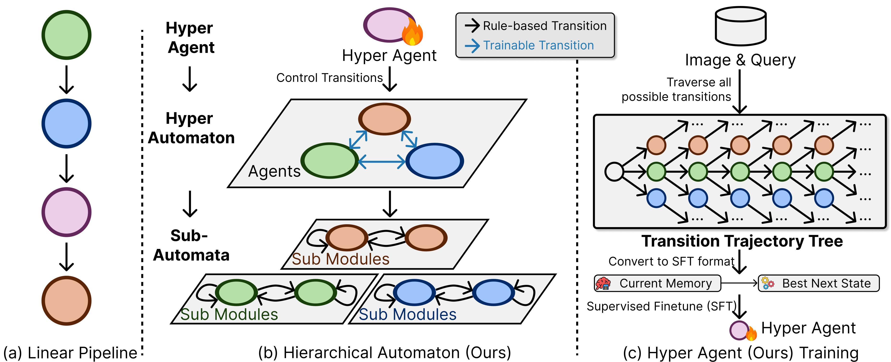
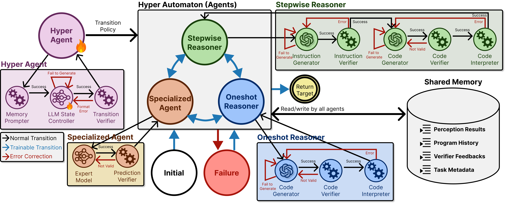

# MATA: A Trainable Hierarchical Automaton System for Multi-Agent Visual Reasoning

**Paper ID:** arXiv:2601.19204 (ICLR 2026)

## Authors
- Zhixi Cai, Fucai Ke, Kevin Leo, Sukai Huang, Maria Garcia de la Banda, Peter J. Stuckey, Hamid Rezatofighi (Monash University)

---

## Abstract

We present MATA (Multi-Agent hierarchical Trainable Automaton), a novel multi-agent system for visual reasoning. MATA is presented as a hierarchical finite-state automaton where top-level transitions are chosen by a trainable hyper agent, while each agent runs a rule-based sub-automaton for micro-control. We build MATA-SFT-90K, a dataset of 90,854 training examples, and achieve state-of-the-art results on GQA, OK-VQA, and Referring Expression benchmarks.

---

## Introduction

Visual reasoning remains a challenging task for AI systems, requiring understanding of complex scenes, spatial relationships, and contextual information. While LLMs have shown impressive reasoning capabilities, applying them to visual tasks introduces unique challenges.

Existing approaches include:
1. **Monolithic VLMs**: Single models handling all aspects
2. **Compositional Methods**: Breaking tasks into subcomponents
3. **Multi-Agent Systems**: Multiple agents collaborating

However, these approaches often suffer from:
- Rigid execution orders
- Complex communication protocols
- Limited reasoning capabilities

MATA addresses these issues by introducing a hierarchical automaton where:
- A hyper agent decides which specialized agent to use
- Each sub-agent handles specific reasoning tasks
- The system can be trained to optimize transition decisions

---

## Method

### Hierarchical Automaton
1. **Hyper Automaton**: Trainable state transition policy (which agent to use)
2. **Sub Automata**: Rule-based micro-control (how each agent behaves)

### States: INITIAL, ONESHOT, STEPWISE, SPECIALIZED, FINAL, FAILURE

---

## Results

### Table 1: GQA Performance

| Method | Accuracy (%) |
|--------|--------------|
| ViperGPT | 37.9 |
| MATA | **64.9** |

### Table 2: OK-VQA Performance

| Method | Accuracy (%) |
|--------|--------------|
| GPT-4o | 75.7 |
| MATA | **76.5** |

---

## Key Figures

### Figure 1: MATA Overview

### Figure 2: Pipeline

---

## Main Contributions

1. Hierarchical automaton design
2. Trainable transition mechanism
3. MATA-SFT-90K dataset (90,854 examples)
4. SOTA on GQA, OK-VQA, RefCOCO
