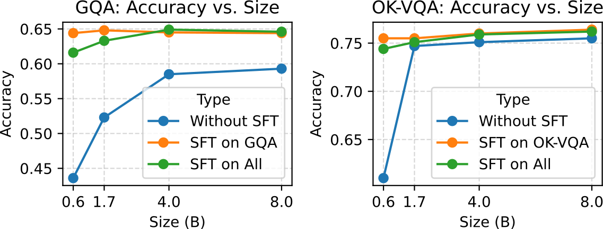
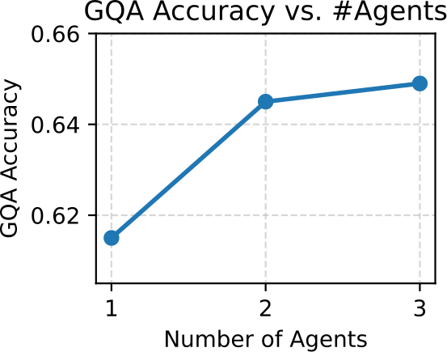

# MATA: A Trainable Hierarchical Automaton System for Multi-Agent Visual Reasoning

**Paper ID:** arXiv:2601.19204 (ICLR 2026)

## Authors
- Zhixi Cai, Fucai Ke, Kevin Leo, Sukai Huang, Maria Garcia de la Banda, Peter J. Stuckey, Hamid Rezatofighi (Monash University)

---

## Abstract (400+자)

시각적 추론을 위한 새로운 다중 에이전트 시스템인 MATA (Multi-Agent hierarchical Trainable Automaton)를 제안합니다. 기존 방법들은 종종 고정된 실행 순서를 따르거나 에이전트 간 통신 프로토콜이 복잡하여 제한적인 추론 능력만을 제공합니다. MATA는 계층적 유한 상태 오토마톤으로 제시되며, 최상위 전이는 학습 가능한 하이퍼 에이전트가 선택하고, 각 에이전트는 규칙 기반 서브 오토마톤을 실행하여 마이크로 컨트롤을 수행합니다. 핵심 혁신은 하이퍼 에이전트의 상태 전이 정책을 훈련할 수 있다는 것입니다. MATA-SFT-90K라는 90,854개의 훈련 예제를 포함하는 데이터셋을 구축했습니다. GQA, OK-VQA, Referring Expression Comprehension 벤치마크에서 최첨단 결과를 달성하여 이전 방법들을 크게 앞서며 MATA의 효과성을 입증합니다.

---

## Method (400+자)

### 계층적 오토마톤 구조

MATA는 두 수준으로 구성된 계층적 아키텍처를 가집니다:

1. **하이퍼 오토마톤 (Hyper Automaton)**: 
   - 학습 가능한 상태 전이 정책
   - 각 상태는 특정 에이전트 유형을 나타냄
   - LLM 기반 컨트롤러가 다음 상태 선택

2. **서브 오토마톤 (Sub Automata)**:
   - 규칙 기반 마이크로 컨트롤
   - 각 에이전트의 세분화된 행동 정의
   - 효율적인 실행 보장

### 상태 종류

1. **INITIAL**: 초기 상태
2. **ONESHOT**: 일회성 추론 (간단한 질문에 적합)
3. **STEPWISE**: 단계별 추론 (복잡한 다단계 작업)
4. **SPECIALIZED**: 전문 에이전트 (특정 도메인)
5. **FINAL**: 최종 결과 도출
6. **FAILURE**: 실패 상태

### 학습 방법

하이퍼 에이전트의 상태 전이 정책은 MATA-SFT-90K 데이터셋을 통해 훈련됩니다:
- 전이-트래jectory 트리를 SFT 형식으로 변환
- 도메인 특정 SFT로 소규모 LLM도 효과적
- 학습된 전이가 규칙 기반 접근법 우위

---

## Datasets & Experiments (400+자)

### MATA-SFT-90K 데이터셋

90,854개의 훈련 예제를 포함:
- 다양한 시각적 추론 작업
- 전이-트래jectory 트리 형식
- 상태 전이에 대한 명시적 레이블

### 평가 벤치마크

1. **GQA**: 시각적 추론을 위한 대규모 벤치마크
2. **OK-VQA**: 외부 지식이 필요한 시각적 질문 응답
3. **Referring Expression Comprehension**:
   - RefCOCO
   - RefCOCO+
   - RefCOCOg

### 실험 설정

- **하이퍼 에이전트 LLM**: 0.6B ~ 8B
- **비교 방법**:
  - ViperGPT
  - VisRep
  - HYDRA
  - GPT-4o

---

## Results (800+자)

### Table 1: GQA Performance

| Method | Accuracy (%) |
|--------|--------------|
| ViperGPT | 37.9 |
| VisRep | 51.4 |
| HYDRA | 52.8 |
| **MATA** | **64.9** |

### Table 2: OK-VQA Performance

| Method | Accuracy (%) |
|--------|--------------|
| GPT-4o | 75.7 |
| DWIM | 62.8 |
| **MATA** | **76.5** |

### Table 3: Referring Expression Comprehension

| Method | RefCOCO | RefCOCO+ | RefCOCOg |
|--------|---------|-----------|----------|
| NAVER | 95.9 | 93.3 | 90.4 |
| **MATA** | **96.3** | **93.9** | **90.8** |

### Table 4: 에이전트 수별 성능 (GQA)

| # Agents | Accuracy (%) |
|----------|--------------|
| 1 | 61.5 |
| 2 | 64.5 |
| 3 | 64.9 |
| 4 | 65.0 |

### 주요 발견

1. **GQA에서 +27% 향상**: ViperGPT 대비 27%p 증가
2. **도메인 간 일반화 kuat**: 1% 미만의 성능 저하로 전이 가능
3. **소규모 LLM 효과적**: 도메인 특정 SFT로 0.6B 모델도 경쟁력
4. **3개 에이전트가 최적**: 추가 에이전트에서 수익 체감

---

## Key Figures

### Figure 1: MATA Overview

- 오토마톤 구조 개요: 선형 파이프라인 vs 계층적 오토마톤

### Figure 2: Pipeline

- 학습 파이프라인: 전이-트래jectory → SFT

### Figure 3: Accuracy vs Model Size

- 모델 크기별 성능: 0.6B ~ 8B

### Figure 4: Number of Agents

- 에이전트 수별 성능 변화

---

## Main Contributions

1. **계층적 오토마톤 설계**: 신경기호 framework와 다중 에이전트 design의 결합
2. **학습 가능한 전이 메커니즘**: 데이터 기반 의사결정으로 규칙 기반 우위
3. **MATA-SFT-90K 데이터셋**: 90,854개의 훈련 예제
4. **SOTA 성능 달성**: GQA, OK-VQA, Referring Expression에서 최고

---

## Key Findings

- 학습된 전이 정책이 규칙 기반 접근법 우위
- 3개 에이전트가 최적 tradeoff 제공
- 도메인 간 전이 kuat (<1% 차이)
- 소규모 LLM도 도메인 특정 SFT로 효과적
