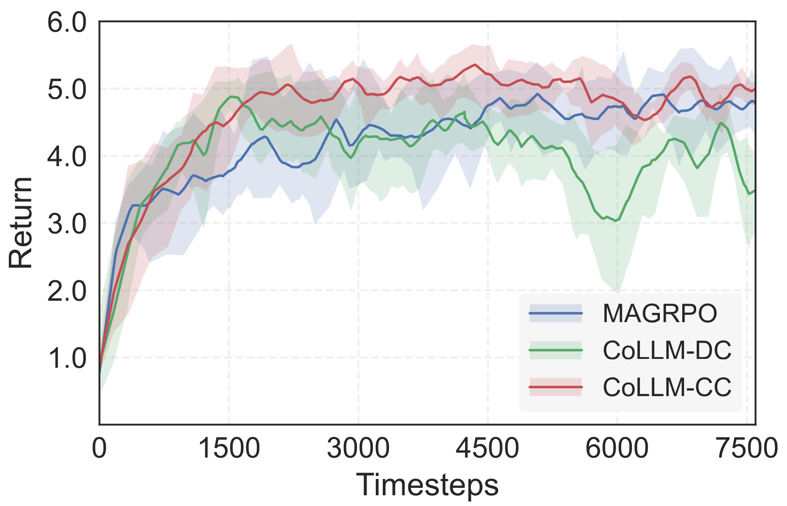
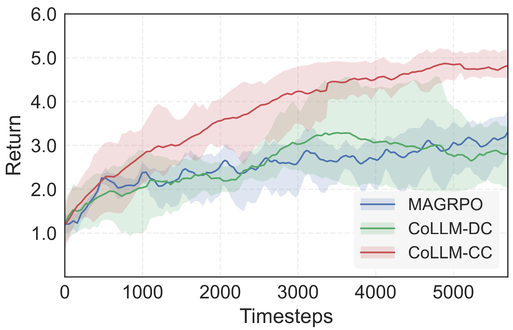
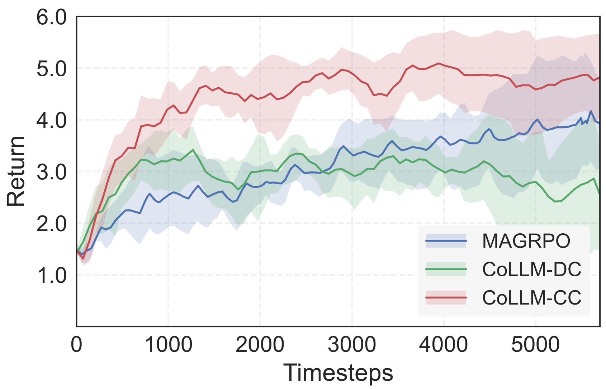

# Learning Decentralized LLM Collaboration with Multi-Agent Actor Critic

**Paper ID:** arXiv:2601.21972

## Authors
- Shuo Liu, Tianle Chen, Ryan Amiri, Christopher Amato (Northeastern University)

## Abstract
분산 LLM 협력을 최적화하기 위한 Multi-Agent Actor-Critic (MAAC) 방법을 개발합니다. CoLLM-CC (중앙 집중식 Critic)와 CoLLM-DC (분산 Critic) 두 가지 접근법을 제안합니다. 글쓰기, 코딩, 게임 영역에서의 실험结果显示 단기/밀집 보상 설정에서 모든 방법이 유사하지만, 장기/희소 보상 작업에서 CoLLM-CC가 훨씬 뛰어납니다.

## Method

### CoLLM-CC (Centralized Critic)
중앙 집중식 Critic이联合 역사값을 추정합니다. 학습 시 Critic은 joint history를 조건으로 하지만, 실행 시 에이전트는 분산적으로 동작합니다.

### CoLLM-DC (Decentralized Critic)
각 에이전트가 자신의 역사값을 추정하는 분산 Critic을 사용합니다.

## Datasets & Experiments

### Tasks
1. **TLDR Summarization**: 2개 에이전트가 RedditPosts 요약
2. **arXiv Expansion**: 논문 초안을 완전한 서론으로 확장
3. **CoopHE**: 협력적 코드 생성을 위한 데이터셋
4. **StrBuild**: Minecraft에서 문자 형태的建筑
5. **HouseBuild**: Minecraft에서 집 건설 + 적 공격 방어

## Results

### Table 1: Performance Comparison

| Method | TLDR Time | TLDR Cost | TLDR Score | arXiv Time | arXiv Cost | arXiv Score | StrBuild Time | StrBuild Cost | StrBuild Adj | StrBuild IoU |
|--------|-----------|-----------|------------|------------|------------|-------------|---------------|---------------|--------------|--------------|
| Raw Model | 5.0 | 465 | 30.3 | 5.1 | 472 | 44.0 | 10.6 | 427 | 0.9 | 36.6 |
| GRPO | 4.1 | 387 | 91.7 | 4.2 | 398 | 91.0 | 10.3 | 411 | 0.4 | 46.1 |
| AC | 4.0 | 374 | 94.7 | 4.3 | 392 | 95.3 | 10.3 | 413 | 0.4 | 49.8 |
| Parallel | 2.3 | 244 | 22.7 | 2.3 | 246 | 49.0 | 9.4 | 232 | 15.7 | 5.9 |
| Pipeline | 4.3 | 238 | 21.7 | 3.9 | 203 | 57.0 | 9.8 | 246 | 12.9 | 18.7 |
| Discussion | 4.6 | 234 | 22.3 | 4.8 | 251 | 54.3 | 10.3 | 236 | 16.2 | 6.5 |
| MAGRPO | 1.8 | 178 | 93.5 | 2.0 | 201 | 93.1 | 9.4 | 226 | 13.3 | 50.6 |
| CoLLM-DC | 1.9 | 194 | 95.4 | 2.0 | 196 | 94.1 | 9.3 | 182 | 7.6 | 44.6 |
| **CoLLM-CC** | **1.8** | **181** | **95.2** | **1.9** | **188** | **95.0** | **9.5** | **239** | **7.3** | **68.5** |

## Key Figures

### Figure 1: CoLLM-CC Framework

- 에이전트 모델 구조와 중앙 집중식 Critic 아키텍처

### Figure 2: CoLLM-DC Framework

- 분산 Critic 아키텍처

### Figure 3: TLDR Results

- TLDR 요약 작업에서 학습 곡선

### Figure 4: arXiv Results

- arXiv 확장 작업에서 학습 곡선

### Figure 5: Code Generation

- CoopHE 코드 생성 작업 결과

### Figure 6: Minecraft StrBuild

- StrBuild 작업 예시 (ICML 형태 건축)

### Figure 7: Minecraft HouseBuild

- HouseBuild 작업 예시 (집 건설)

## Main Contributions
1. 분산 LLM 협력을 위한 MAAC 방법 개발
2. CoLLM-CC와 CoLLM-DC 두 가지 접근법 제안
3. 포괄적인 실험 평가 (글쓰기, 코딩, 게임)
4. 장기/희소 보상 작업에서 CoLLM-CC의 우위 입증

## Key Findings
- CoLLM-CC가最低 분산과 최고 샘플 효율성
- 장기 작업에서 Monte Carlo 방법과 CoLLM-DC가挣扎
- 32B 규모에서 오픈 模型可以达到 폐쇄 소스 신뢰성
