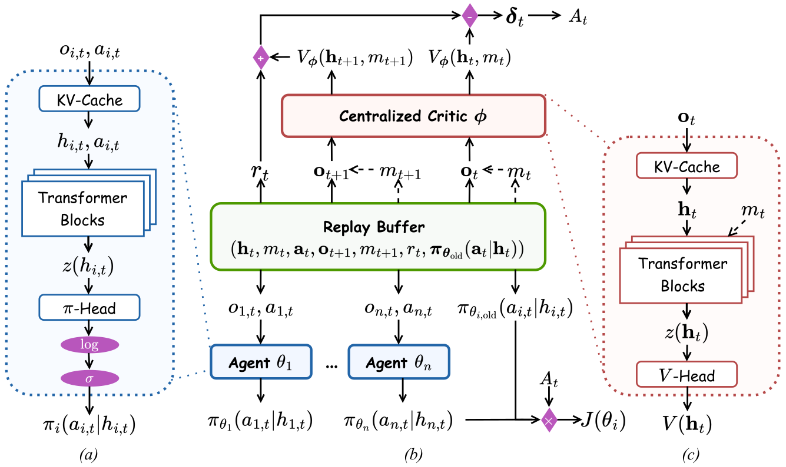
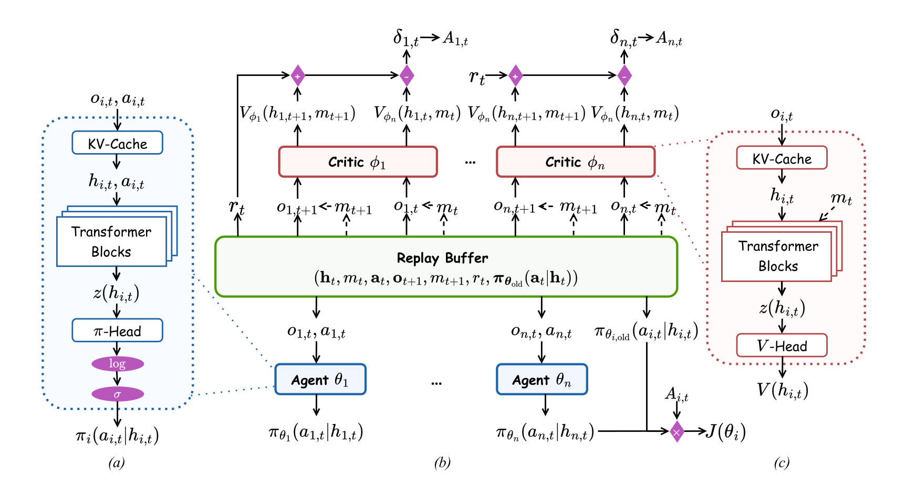
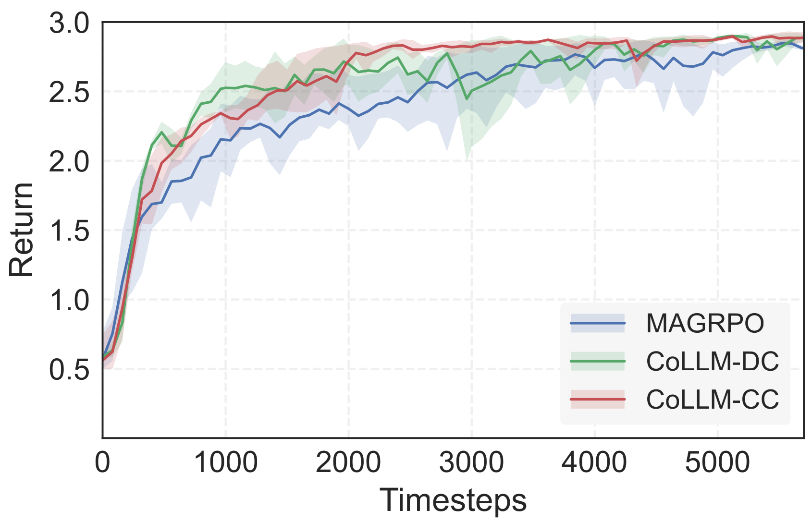
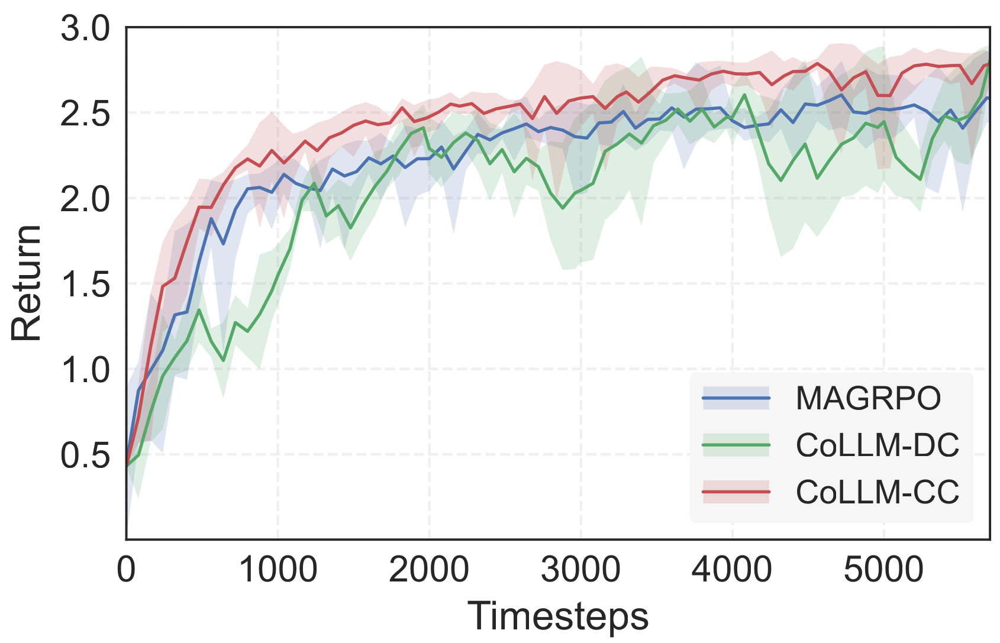

# Learning Decentralized LLM Collaboration with Multi-Agent Actor Critic

**Paper ID:** arXiv:2601.21972

## Authors
- Shuo Liu, Tianle Chen, Ryan Amiri, Christopher Amato (Northeastern University)

---

## Abstract

Recent work has explored optimizing LLM collaboration through Multi-Agent Reinforcement Learning (MARL). However, most MARL fine-tuning approaches rely on predefined execution protocols, which often require centralized execution. Decentralized LLM collaboration is more appealing in practice, as agents can run inference in parallel with flexible deployments. Also, current approaches use Monte Carlo methods for fine-tuning, which suffer from high variance and thus require more samples to train effectively. Actor-critic methods are prevalent in MARL for dealing with these issues, so we developed Multi-Agent Actor-Critic (MAAC) methods to optimize decentralized LLM collaboration. In this paper, we analyze when and why these MAAC methods are beneficial. We propose 2 MAAC approaches: CoLLM-CC with a Centralized Critic and CoLLM-DC with Decentralized Critics. Our experiments across writing, coding, and game-playing domains show that Monte Carlo methods and CoLLM-DC can achieve performance comparable to CoLLM-CC in short-horizon and dense-reward settings. However, they both underperform CoLLM-CC on long-horizon or sparse-reward tasks, where Monte Carlo methods require substantially more samples and CoLLM-DC struggles to converge.

---

## Introduction

Advanced LLMs have demonstrated remarkable capabilities in natural language understanding and generation. This progress has driven growing efforts to transform them into autonomous agents that can solve tasks by proactively interacting with users and systems to obtain feedback and learn from past experience.

In this context, it is becoming popular to explore coordinating multiple LLMs to improve performance where agents are specified by roles, such as generators, planners, or verifiers. Building on the studies of Multi-Agent Systems (MAS), recent methods employ Multi-Agent Reinforcement Learning (MARL) to optimize their interactions. However, most existing approaches remain confined to predefined execution paradigms, which limits their applicability to broader settings. Moreover, these agents often rely on extensive inter-agent communication to accomplish tasks, requiring centralized execution, which results in limited scalability as well as potential privacy issues in larger-scale MAS.

Decentralized systems have been studied for decades, where each agent is deployed separately and executes independently based on its own observations. Leveraging decentralized LLM agents to complete tasks is beneficial, as it reduces memory and storage pressure on each node and improves efficiency. However, how to effectively optimize these decentralized LLMs to collaborate remains an open question.

Although Monte Carlo methods are widely adopted in RL fine-tuning due to their simplicity and efficiency, extending them to optimize multi-LLM collaboration faces many difficulties. Agents need to wait until the end of an episode to receive return signals with high variance. This leads to poor sample efficiency and limits practicality in long-horizon or episodic tasks.

In this paper, we develop Multi-Agent Actor-Critic (MAAC) methods for optimizing decentralized LLM collaboration. We analyze when and why MAAC methods are beneficial for MARL fine-tuning and introduce 2 approaches: CoLLM-CC that employs a centralized critic to estimate joint history values, and CoLLM-DC that uses decentralized critics to estimate individual history values.

---

## Method

### CoLLM-CC (Centralized Critic)
Learns a shared value function Vϕ(ht) that conditions on the joint history to update each agent's policy. The critic is a training construct that can be removed during execution, allowing agents to execute in a decentralized manner.

### CoLLM-DC (Decentralized Critic)
Uses individual critics Vϕi(hi,t) that condition on each agent's local history. This may be harder to converge due to non-stationarity accumulating during training.

---

## Datasets & Experiments

### Tasks
1. **TLDR Summarization**: Two agents summarize Reddit posts with different roles
2. **arXiv Expansion**: Agents expand paper abstracts into full introductions
3. **CoopHE**: Cooperative code generation dataset
4. **StrBuild**: Minecraft string building task
5. **HouseBuild**: Minecraft house building with enemy defense

---

## Results

### Table 1: Overall Performance

| Method | TLDR Score | arXiv Score | StrBuild IoU | HouseBuild IoU |
|--------|------------|-------------|--------------|----------------|
| Raw Model | 30.3 | 44.0 | 36.6 | 43.2 |
| GRPO | 91.7 | 91.0 | 46.1 | 54.6 |
| CoLLM-CC | **95.2** | **95.0** | **68.5** | **52.7** |

---

## Key Figures

### Figure 1: CoLLM-CC Framework

### Figure 2: CoLLM-DC Framework

### Figure 3: TLDR Results

### Figure 4: arXiv Results

---

## Main Contributions

1. Developed MAAC methods for decentralized LLM collaboration
2. Proposed CoLLM-CC and CoLLM-DC approaches
3. Comprehensive evaluation across writing, coding, and gaming
4. Demonstrated CoLLM-CC's superiority in long-horizon tasks
