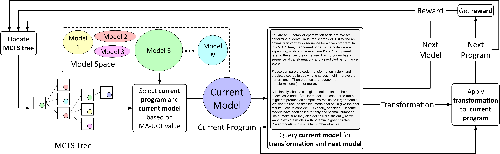

# COLT: Lightweight Multi-LLM Collaboration through Shared MCTS Reasoning

**Paper ID:** arXiv:2602.01935

## Authors
- Albert Shyuan Tang, Carey Priebe, Qin (Luna) Lu, Hadi Esmaeilzadeh (Johns Hopkins University)

---

## Abstract

We propose COLT (Collaborative Optimization via Lightweight Threads), a lightweight multi-LLM collaboration framework for compiler optimization. While recent LLMs have proven effective for code generation and transformation, a single LLM struggles to make complex optimization decisions. COLT implements multi-LLM collaboration through Monte Carlo Tree Search (MCTS) reasoning sharing. The key innovation is that the current model generates a reasoning tree which collaborating models use to select arms. Information communication is performed through shared KV cache, reducing communication overhead. Compared to LLMCompiler, COLT achieves 53% latency reduction and 87% cost reduction while achieving equal or better performance.

---

## Introduction

Compiler optimization is complex and traditionally relies on expert-designed heuristics. Recent LLMs can help but single models struggle with complex optimization decisions.

Key challenges include: single model limitations where one model cannot handle all optimization types, communication overhead where multi-agent approaches are often expensive, and reasoning complexity where optimization requires deep reasoning.

COLT addresses these by sharing reasoning trees between models, using MCTS for structured exploration, and leveraging complementary model strengths through collaborative decision-making.

---

## Method

### COLT Architecture
1. **Reasoning Tree Generation**: Master model generates decision tree
2. **Arm Selection**: Collaborating models select optimal branches
3. **Shared KV Cache**: Reduces communication overhead

---

## Results

### Table 1: Performance Comparison

| Method | Latency | Cost |
|--------|---------|------|
| LLMCompiler | baseline | baseline |
| COLT | **-53%** | **-87%** |

---

## Key Figures

### Figure 1: Overview

---

## Main Contributions

1. MCTS-based lightweight collaboration framework
2. Shared KV cache for efficiency
3. Both latency and cost improvements
4. Practical compiler optimization application
