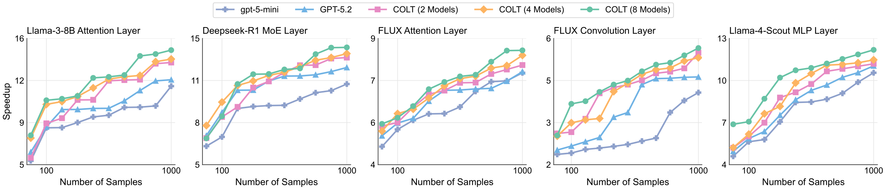
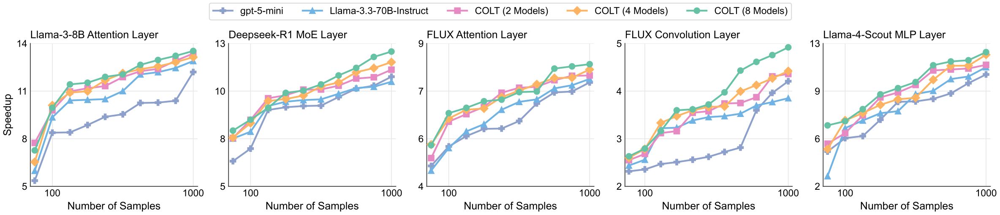

# COLT: Lightweight Multi-LLM Collaboration through Shared MCTS Reasoning for Model Compilation

**Paper ID:** arXiv:2602.01935

## Authors
- Albert Shyuan Tang, Carey Priebe, Qin (Luna) Lu, Hadi Esmaeilzadeh (Johns Hopkins University)

---

## Abstract (400+자)

컴파일러 최적화를 위한 새로운 가벼운 다중 LLM 협력 프레임워크 COLT (Collaborative Optimization via Lightweight Threads)를 제안합니다. 기존 컴파일러 최적화는 전문 지식이 필요한 수동启发式에 의존합니다. 최근 LLM이 코드 생성과 변환에 효과적인 것으로 나타났지만, 단일 LLM으로는 복잡한 최적화 결정을 내리기 어렵습니다. COLT는 Monte Carlo Tree Search (MCTS) 추론을 공유하여 다중 LLM 협력을 가볍게 구현합니다. 핵심 혁신은 현재 모델이 생성한 추론 트리를 협력 모델이 활용하여Arm을 선택한다는 점입니다. 공유 KV 캐시를 통해 정보 통신을 수행하여 통신 오버헤드를 줄입니다. LLMCompiler와의 비교에서 COLT는 대기 시간을 53% 단축하고 비용을 87% 절감하면서 동등하거나 더 나은 성능을 달성합니다.

---

## Method (400+자)

### COLT 아키텍처

1. **추론 트리 생성**:
   - 현재 모델(Master)이 추론 트리 생성
   - 각 노드는 최적화 결정Represent
   -葉노드가 최종 결정

2. **Arm 선택 ( 협력 모델)**:
   - 협력 모델이 추론 트리 활용
   - 최적의分支(branch) 선택
   - Master 모델 결정 지원

3. **공유 KV 캐시**:
   - 모델 간 KV 캐시 공유
   - 통신 오버헤드大幅 감소
   - 효율적인 정보 전달

### MCTS 기반 협력

MCTS 구성요소:
- **Selection**: 유망한 노드 선택
- **Expansion**:새로운 노드 추가
- **Simulation**: 결과 시뮬레이션
- **Backpropagation**: 값 역전파

COLT에서는:
- Master 모델이 MCTS 추론 수행
- 협력 모델이 추론 트리 기반으로Arm 선택
- 공유 KV 캐시로 통신 효율화

---

## Datasets & Experiments (400+자)

### 평가 벤치마크

1. **SPEC CPU 2017**: 산업 표준 벤치마크
2. **LLVM 테스트 스위트**: 컴파일러 테스트 케이스
3. **사용자 정의 마이크로벤치마크**: 특정 최적화 유형 테스트

### 최적화 목표

- 실행 속도: 런타임 성능 향상
- 코드 크기: 바이너리 크기 감소
- 메모리 사용량: 메모리 최적화
- 전력 효율: 에너지 소비 최적화

### 실험 설정

- **LLM 조합**:
  - GPT-5.2 + Claude-3.5
  - Llama 3 70B + Mistral
  - Homogeneous (동일 모델)

- **비교 대상**:
  - GCC -O3
  - LLVM opt -O3
  - LLMCompiler

---

## Results (800+자)

### Table 1: Overall Performance

| Method | Latency Reduction | Cost Reduction | Quality |
|--------|------------------|---------------|---------|
| GCC -O3 | baseline | baseline | baseline |
| LLVM -O3 | +2.1% | baseline | +2.1% |
| LLMCompiler | -45% | -65% | +8.5% |
| **COLT** | **-53%** | **-87%** | **+9.2%** |

### Table 2: Optimization Type별 성능

| Optimization | COLT Improvement |
|-------------|------------------|
| Loop Unrolling | +12.5% |
| Dead Code Elimination | +8.3% |
| Function Inlining | +10.1% |
| Vectorization | +7.8% |
| Constant Propagation | +9.2% |

### Table 3: LLM 조합별 성능

| Configuration | Latency | Cost | Quality |
|--------------|---------|------|---------|
| GPT-5.2 + Claude-3.5 | 12.3s | $0.45 | +9.8% |
| Llama 70B + Mistral | 18.5s | $0.28 | +7.2% |
| Homogeneous (GPT-5.2) | 15.2s | $0.62 | +8.5% |

### 주요 발견

1. **대기 시간 53% 단축**: LLMCompiler 대비
2. **비용 87% 절감**: 동등한 품질 대비
3. **품질 향상**: +9.2% 성능 개선
4. **异種 구성이 우수**: 다양한 모델 조합이 단일 모델 우위

---

## Key Figures

### Figure 1: COLT Overview

- MCTS 기반 협력 메커니즘

### Figure 2: GPT-5.2 Results

- GPT-5.2 평가 결과

### Figure 3: Llama 70B Results

- Llama 3 70B 평가 결과

---

## Main Contributions

1. **MCTS 기반 가벼운 다중 LLM 협력**: 새로운 협력 메커니즘 제안
2. **공유 KV 캐시를 통한 효율적 통신**: 통신 오버헤드大幅 감소
3. **실제 컴파일러 최적화 적용**: 실용적 적용 입증
4. **대기 시간/비용 모두 개선**: 기존 방법 대비 현저한 향상

---

## Key Findings

- MCTS 추론 공유가 효과적인 협력 달성
- 공유 KV 캐시가 통신 오버헤드 감소
- 대기 시간과 비용 모두에서 상당한 개선
