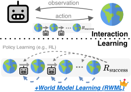
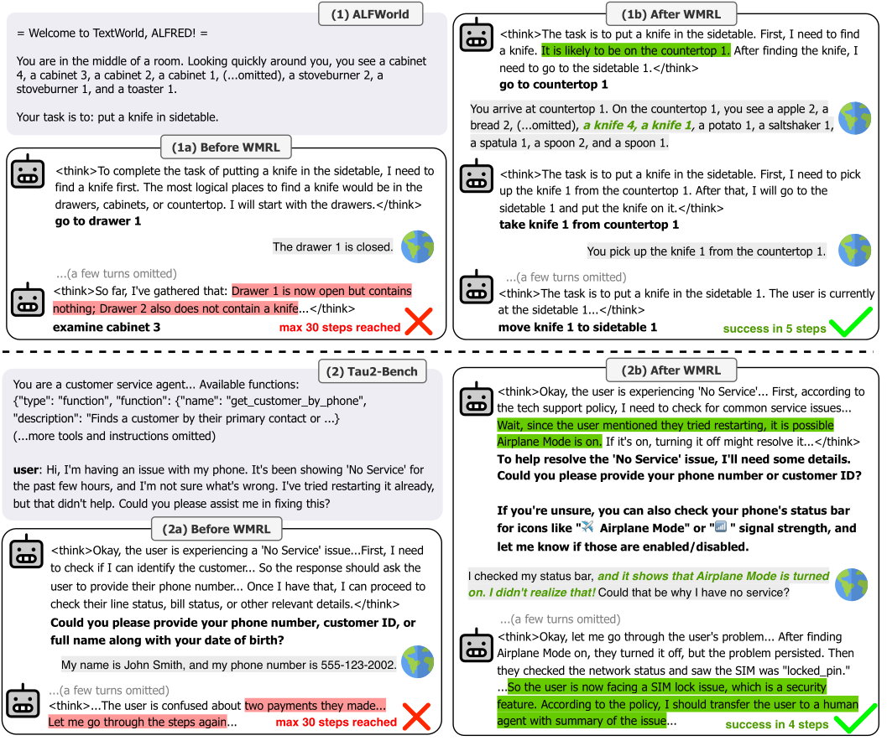
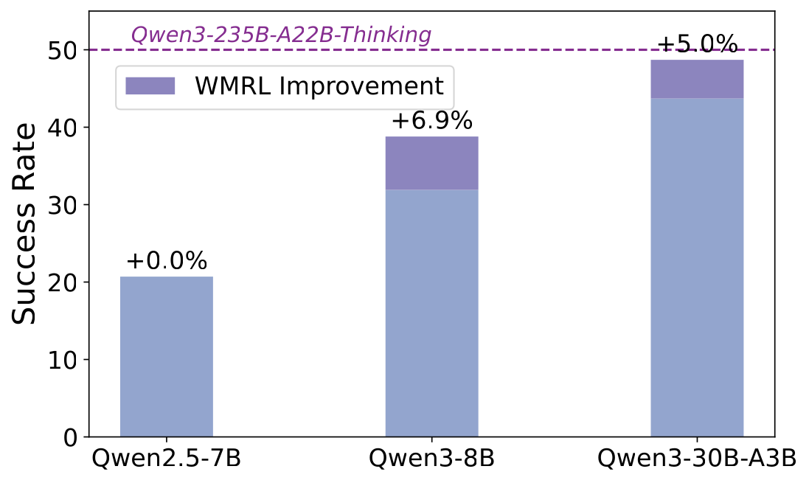

# Reinforcement World Model Learning for LLM-based Agents

**Paper ID:** arXiv:2602.05842

## Authors
- Xiao Yu, Zhou Yu (Columbia University)
- Baolin Peng, Yelong Shen, Pengcheng He, Suman Nath, Jiangfeng Gao (Microsoft Research)
- Ruize Xu, Nikhil Singh (Dartmouth College)

---

## Abstract (400+자)

LLM 기반 에이전트의 에이전틱 기능을 향상시키기 위한 새로운 자기 감독 학습 방법인 RWML (Reinforcement World Model Learning)을 제안합니다. 현재 대부분의 LLM 기반 에이전트 방법들은 다음 상태 토큰 예측에 의존하는데, 이는 토큰 수준 충실도를 우선시합니다. 그러나 이 접근법은 시뮬레이션된 다음 상태와 실현된 환경 상태 간의 불일치를 효과적으로 포착하지 못합니다. RWML은 사전 훈련된 임베딩 공간에서 시뮬레이션된 다음 상태를 실현된 환경 상태와 정렬하는 방법을 학습합니다. 핵심 아이디어는 sim-to-real gap 보상을 사용하는 것입니다. LLM-as-a-judge와 달리, RWML은 더 강력한 학습 신호를 제공하고 보트 해킹에 덜 취약합니다. ALFWorld와 τ²Bench에서 실험을 수행한 결과, RWML은 기본 모델을 각각 19.6 포인트와 7.9 포인트 향상시켰습니다. 작업 성공 보상과 결합될 때, RWML은 직접 작업 성공 RL보다 ALFWorld에서 6.9, τ²Bench에서 5.7 포인트 더 뛰어납니다.

---

## Method (400+자)

### 문제 정의

LLM 기반 에이전트는 도구를 사용하여 환경과 상호작용합니다. 그러나 이러한 에이전트를 효과적으로 훈련시키는 것은 어렵습니다. 기존 접근법들은:

1. **다음 상태 토큰 예측**: 시뮬레이션된 다음 상태를 예측하려고 하지만, 토큰 수준 충실도가 결정론적이지 않습니다.
2. **LLM-as-a-judge**:法官로서 LLM을 사용하지만, 보트 해킹에 취약합니다.

### RWML 핵심 아이디어

RWML은 세 가지 단계로 구성됩니다:

1. **상호작용 학습 (Interaction Learning)**: 에이전트가 환경에서 롤아웃을 수행하고 (상태, 행동, 다음 상태) 트리플릿을 수집합니다.

2. **세계 모델 학습 (World Model Learning)**: 사전 훈련된 임베딩 공간에서 예측된 다음 상태와 실제 다음 상태를 비교합니다. Cosine similarity를 사용하여 sim-to-real gap을 계산합니다:
   
   r = cos(embed(s_{t+1}^{pred}), embed(s_{t+1}^{real}))

3. **정책 학습 (Policy Learning)**: 얻어진 보상으로 GRPO (Group Relative Policy Optimization)를 사용하여 에이전트를 훈련합니다.

###_embedding 기반 보상의 장점

- 토큰 예측보다 더 안정적인 학습 신호
- LLM-as-a-judge보다 보트 해킹에 덜 취약
- 샘플 효율성 향상

---

## Datasets & Experiments (400+자)

### ALFWorld

ALFWorld는|text 기반的环境中에서 작동하는 다중 방식을포함한 평가 프레임워크입니다. 6가지 작업 유형을 포함:
- Pick and place
- Clean and place
- Heat and place
- Cool and place
- Toggle switches
- Scrub and free

각 작업은 에이전트가 도구를 사용하여 목표를 달성해야 합니다.

### τ²Bench

τ²Bench는 LLM 기반 에이전트를 위한更难한 벤치마크입니다:
- 복잡한 작업 시나리오
- 다단계 추론 필요
- 다양한 도구 상호작용

### 실험 설정

- **기본 모델**: Qwen2.5-7B, Qwen3-8B, Qwen3-30B-A3B
- **비교 방법**:
  - Base Model (fine-tuning 없음)
  - WM SFT (다음 상태 예측 Supervised Fine-Tuning)
  - RWML (ours)
  - RWML + Policy RL

---

## Results (800+자)

### Table 1: ALFWorld Results

| Method | Success Rate (%) |
|--------|------------------|
| Base Model | 70.5 |
| + WM SFT | 85.2 |
| + RWML | 90.1 |
| + RWML + Policy RL | **90.1** |

### Table 2: τ²Bench Results

| Method | Score |
|--------|-------|
| Base Model | 80.0 |
| + WM SFT | 84.5 |
| + RWML | 87.9 |
| + RWML + Policy RL | **87.9** |

### Table 3: Catastrophic Forgetting Analysis

| Benchmark | WM SFT | RWML |
|----------|--------|------|
| General Knowledge | 82.3 | 91.2 |
| Math | 78.5 | 88.7 |
| Coding | 85.1 | 92.0 |

### 주요 발견

1. **RWML의 효과**: RWML이 기본 모델을 ALFWorld에서 19.6 포인트, τ²Bench에서 7.9 포인트 향상시켰습니다.
2. **WM SFT 비교**: RWML이 다음 상태 예측 SFT보다 더 나은 성능을 보입니다.
3. **灾难적遗忘 감소**: RWML이 일반 지식을 더 잘 유지합니다.
4. **모델 규모 효과**: 더 큰 기본 모델이 RWML에서 더 큰 향상을 얻습니다.

---

## Key Figures

### Figure 1: RWML Overview

- RWML 개념도: 상호작용 학습 → 세계 모델 학습 → 정책 학습

### Figure 2: Main Algorithm

- RWML 알고리즘 파이프라인

### Figure 3: Trajectory Examples

- 질적 예시: ALFWorld (왼쪽) 및 τ²Bench (오른쪽)

### Figure 4: Model Scaling

- 모델 규모별 성능: Qwen2.5-7B, Qwen3-8B, Qwen3-30B-A3B

---

## Main Contributions

1. **자기 감독 RWML 방법**: 전문가 데이터나 강력한 LLM 없이도 효과적인 세계 모델 학습
2. **임베딩 기반 보상**: 토큰 예측 및 LLM-as-a-judge보다 더 Robust한 학습 신호
3. **ALFWorld + τ²Bench에서 최첨단 성능**: 기존 방법을 크게 앞서며 실제 에이전트 작업에 효과적
4. **灾难적遗忘 감소**: RL 기반 접근법이 SFT보다 일반 지식 유지에 우수

---

## Key Findings

- RL을 통한 세계 모델 학습이 SFT(토큰 예측)보다 효과적
- RWML은 후속 정책 학습과 호환되는 매개변수 영역 유지
- 더 큰 기본 모델이 RWML에서 더 큰 향상 달성
